# Vyra Platform Architecture v7

# Canonical Diagram Set v1

## Agentic Risk & Compliance Infrastructure

**Status:** Baselined

**Purpose**

This document contains the canonical Mermaid diagram definitions for the Vyra Platform Architecture v7.

These diagrams serve as the source of truth for:

* Architecture Documentation
* Executive Decks
* Product Narratives
* Engineering Design Documents
* Website Content
* Future Diagram Rendering

---

# Diagram 1

# From Documentation to Operational Assurance

## Purpose

Define the category shift.

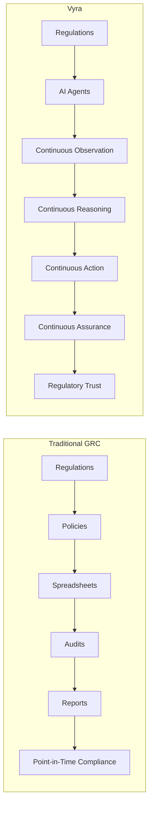

---

# Diagram 2

# Continuous Compliance Loop

## Purpose

Define the platform operating model.

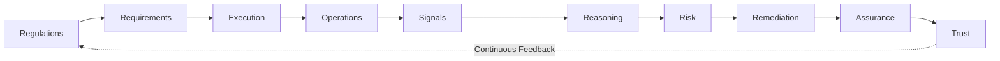

---

# Diagram 3

# Vyra Compliance Engine

## Purpose

Show how regulations become trust.

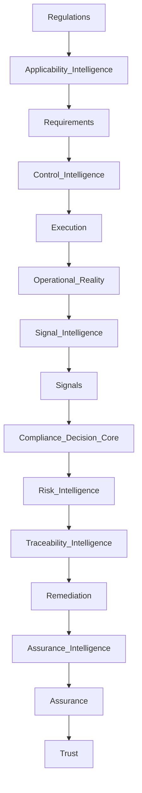

---

# Diagram 4

# Compliance Decision Architecture

## Purpose

Explain platform reasoning.

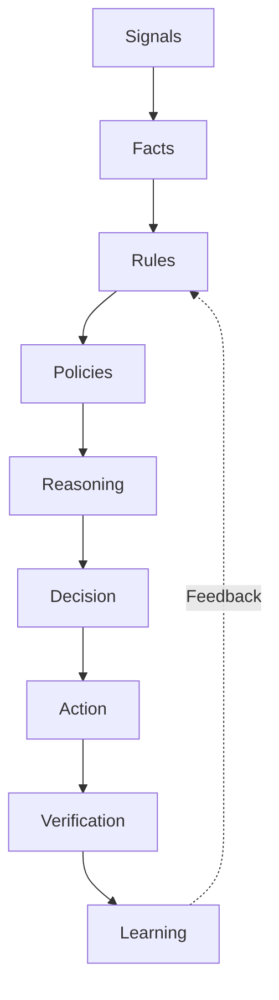

---

# Diagram 5

# Compliance Autonomy Levels

## Purpose

Define agent trust boundaries.

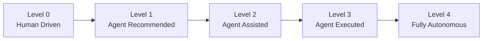

---

# Diagram 6

# Agent Ecosystem

## Purpose

Visualize the AI workforce.

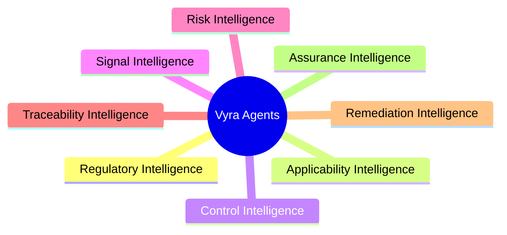

---

# Diagram 7

# Agent Lifecycle

## Purpose

Standard operating model for all agents.

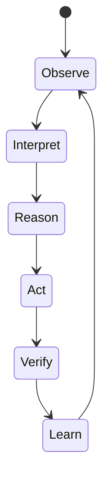

---

# Diagram 8

# Shared Memory Architecture

## Purpose

Show how agents collaborate.

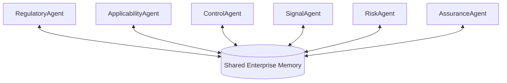

---

# Diagram 9

# Compliance Digital Twin

## Purpose

Introduce Vyra's defining architectural concept.

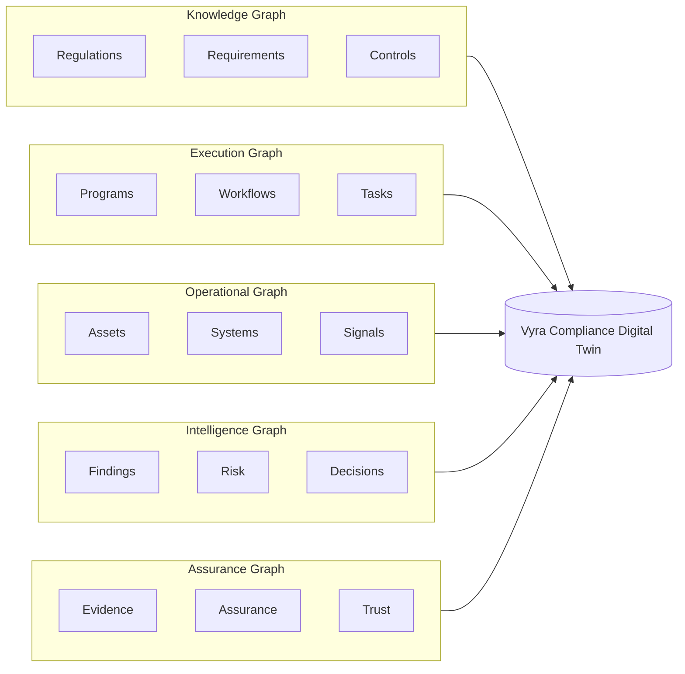

---

# Diagram 10

# Five Enterprise Graphs

## Purpose

Explain the five synchronized enterprise perspectives.

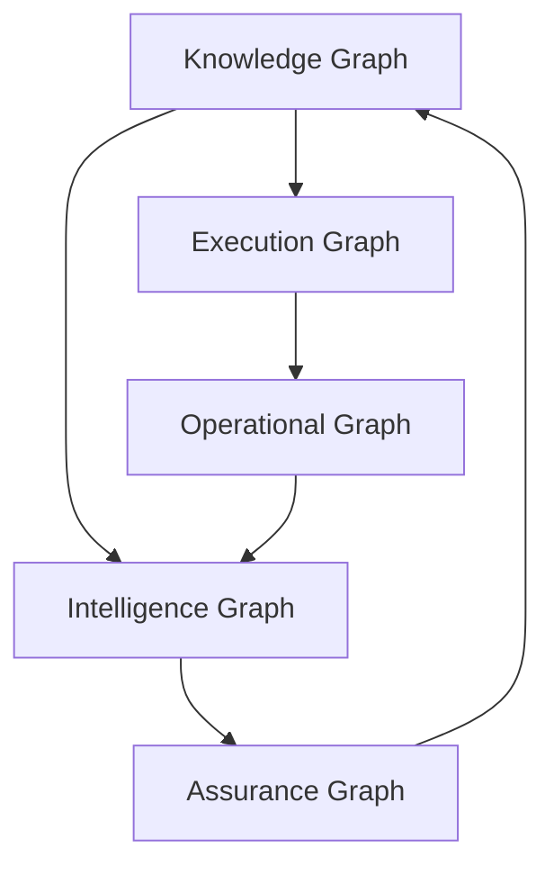

---

# Diagram 11

# Compliance Traceability Architecture

## Purpose

Explain forward and reverse traceability.

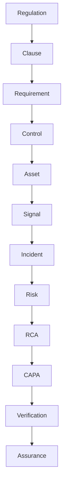

---

# Diagram 12

# Platform Services Architecture

## Purpose

Explain runtime architecture.

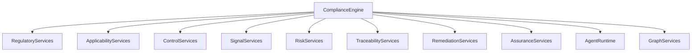

---

# Diagram 13

# Regulatory Trust Architecture

## Purpose

Show trust stakeholders.

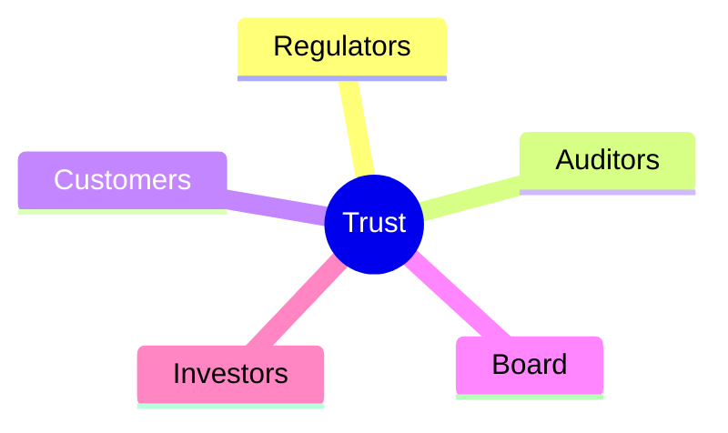

---

# Diagram 14

# Future Architecture Roadmap

## Purpose

Show platform evolution.

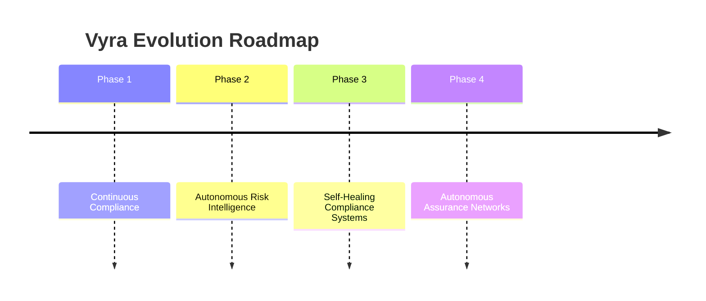

---

# Signature Diagrams

The following are considered architecture-defining diagrams and must be maintained as first-class assets:

1. Continuous Compliance Loop
2. Vyra Compliance Engine
3. Compliance Digital Twin
4. Five Enterprise Graphs
5. Shared Memory Architecture
6. Compliance Traceability Architecture

These six diagrams collectively define the Vyra platform architecture.
