# Vyra Platform Architecture v7

# Canonical Diagram Set v2 (Executive Quality)

## Purpose

Diagram Set v2 elevates the core architecture from simple component diagrams to architecture-defining platform models.

These diagrams are intended to become:

* Executive Deck visuals
* Investor-facing architecture
* Platform whitepaper diagrams
* Website architecture assets
* Design partner materials

The focus is not implementation.

The focus is communicating:

> How Vyra continuously converts regulations into trust.

---

# Signature Diagram 1

# Continuous Compliance Operating System

## Purpose

The single most important diagram in the architecture.

This diagram explains the entire platform in one view.

```mermaid
flowchart LR

    Regulations["Regulations & Standards"]

    Applicability["Applicability Intelligence"]

    Requirements["Requirements"]

    Controls["Control Intelligence"]

    Execution["Execution"]

    Operations["Operational Reality"]

    Signals["Signal Intelligence"]

    Decisions["Compliance Decision Core"]

    Risk["Risk Intelligence"]

    Traceability["Traceability Intelligence"]

    Remediation["Remediation"]

    Assurance["Assurance Intelligence"]

    Trust["Regulatory Trust"]

    Regulations --> Applicability

    Applicability --> Requirements

    Requirements --> Controls

    Controls --> Execution

    Execution --> Operations

    Operations --> Signals

    Signals --> Decisions

    Decisions --> Risk

    Risk --> Traceability

    Traceability --> Remediation

    Remediation --> Assurance

    Assurance --> Trust

    Trust -. Continuous Feedback .-> Regulations
```

### Executive Message

Vyra operates a continuous compliance system rather than a compliance workflow.

---

# Signature Diagram 2

# Compliance Digital Twin

## Purpose

Vyra's defining platform concept.

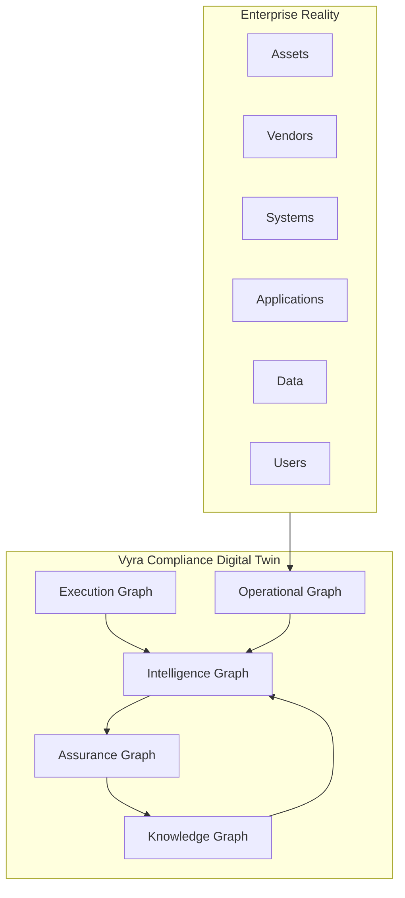

### Executive Message

The Digital Twin continuously models obligations, reality, risk, and assurance.

---

# Signature Diagram 3

# Five Enterprise Graphs

## Purpose

Explain graph responsibilities and interactions.

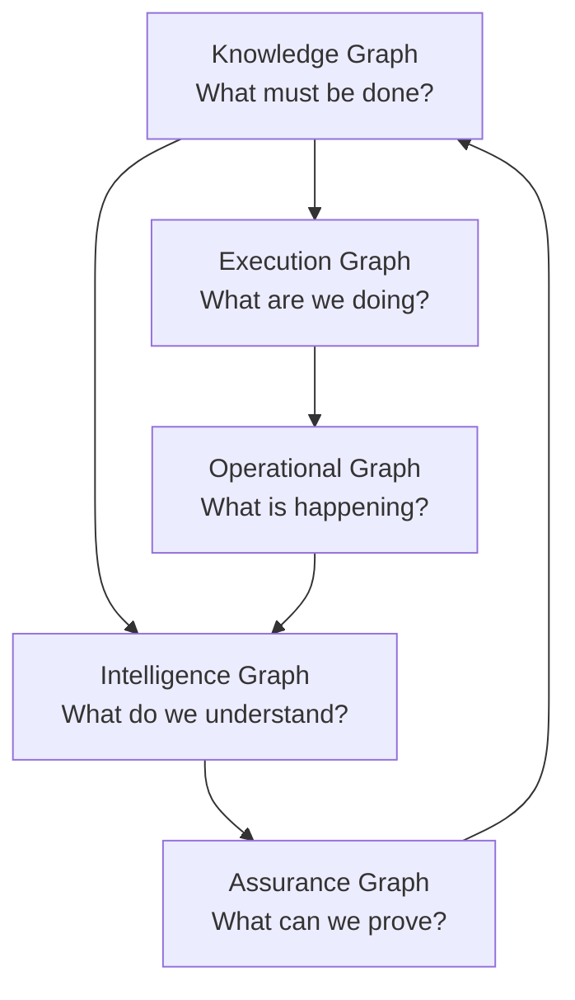

### Executive Message

The graphs are not separate databases.

They are synchronized perspectives of the same enterprise state.

---

# Signature Diagram 4

# Shared Memory Architecture

## Purpose

Show how agents collaborate.

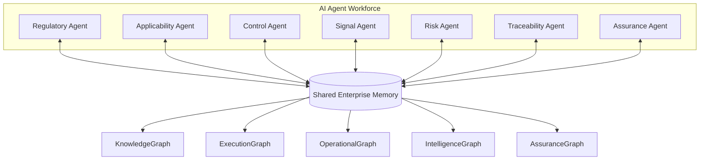

### Executive Message

Agents collaborate through memory rather than direct orchestration.

---

# Signature Diagram 5

# Compliance Traceability Architecture

## Purpose

Demonstrate explainability.

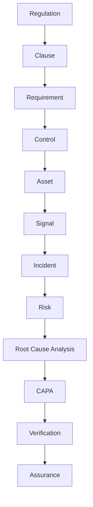

### Executive Message

Every compliance outcome is explainable.

Every incident is traceable.

Every assurance statement is verifiable.

---

# Signature Diagram 6

# Multi-Agent Compliance System

## Purpose

Show how intelligence emerges.

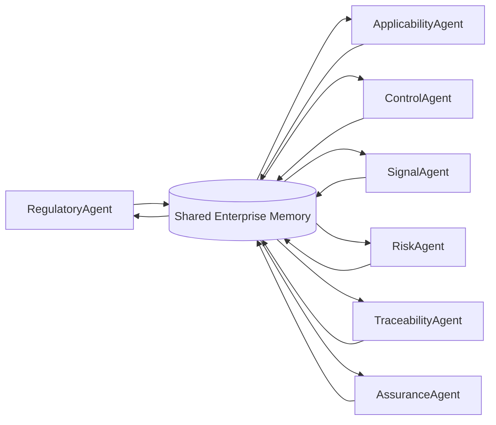

### Executive Message

Compliance intelligence emerges from collaborating agents operating on shared memory.

---

# Supporting Diagram 1

# Compliance Decision Architecture

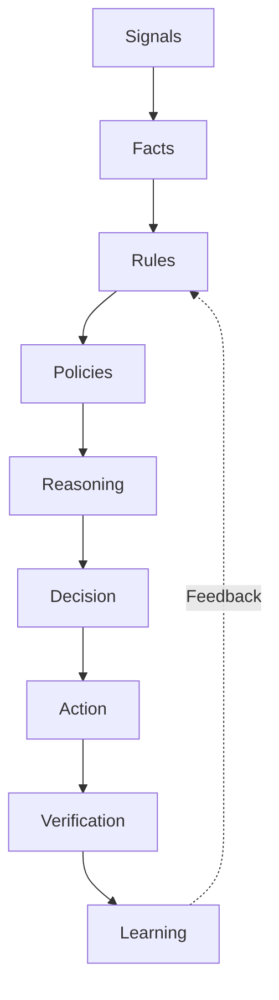

---

# Supporting Diagram 2

# Compliance Autonomy Levels

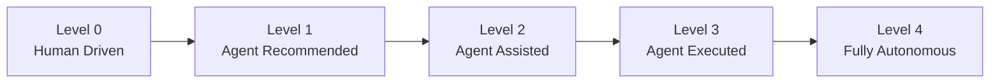

---

# Supporting Diagram 3

# Agent Lifecycle

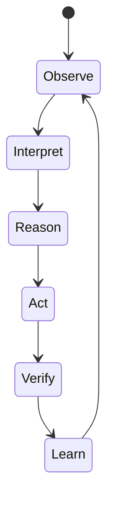

---

# Supporting Diagram 4

# Platform Services Architecture

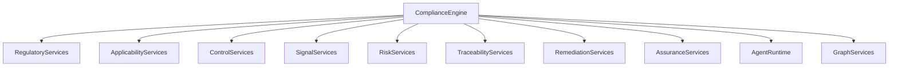

---

# Supporting Diagram 5

# Regulatory Trust Architecture

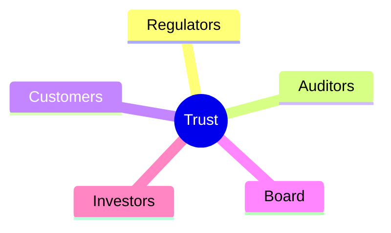

---

# Supporting Diagram 6

# Future Architecture Roadmap

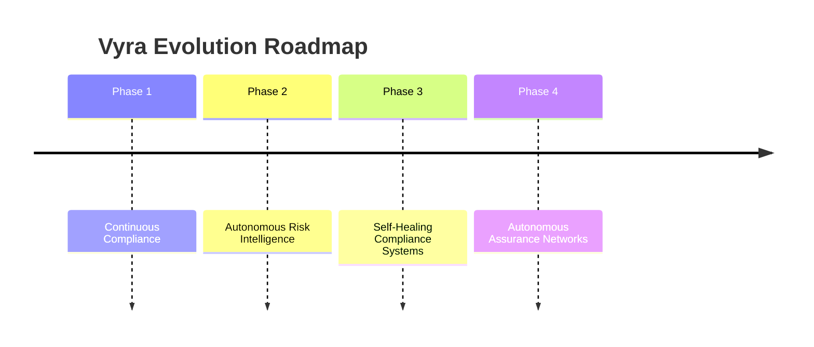

---

# Architecture Narrative Mapping

| Diagram                                | Narrative Role      |
| -------------------------------------- | ------------------- |
| Continuous Compliance Operating System | Platform Story      |
| Compliance Digital Twin                | Core Differentiator |
| Five Enterprise Graphs                 | Memory Architecture |
| Shared Memory Architecture             | Agent Collaboration |
| Compliance Traceability Architecture   | Explainability      |
| Multi-Agent Compliance System          | Intelligence Model  |

These six diagrams collectively define the Vyra platform architecture and should be treated as architecture-governing assets.
