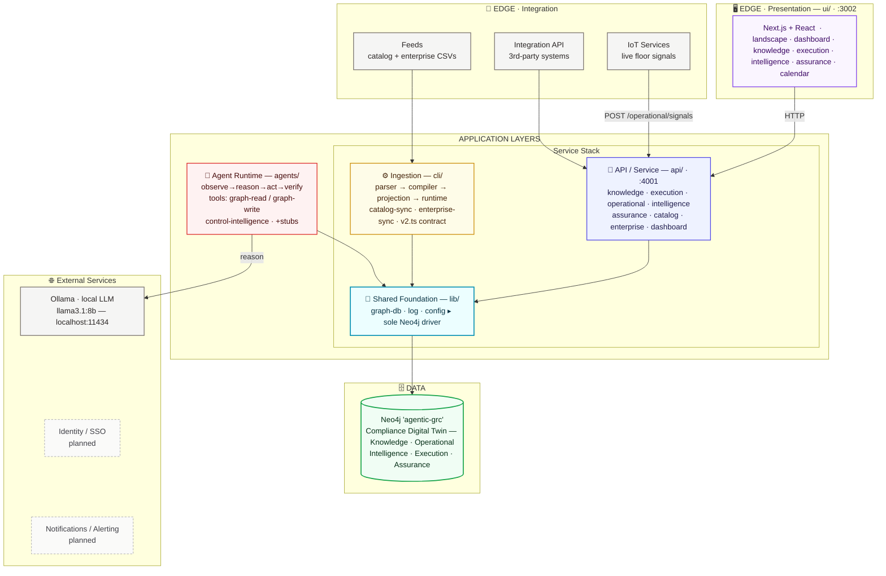

# Vyra Architecture

**The platform's layers and components — how Vyra is built.** Where `vyra-graph-spine.md` is the ground truth for *what* Vyra stores (the graph model), this document is the ground truth for *how the software is layered around it*: the runtime components, who talks to whom, and the access rules that keep the layers honest.

> Companion docs: `vyra-landscape.md` (vision + operating model), `vyra-graph-spine.md` (the graph schema this architecture serves), `vyra-implementation-plan.md` (sequencing + build status).

---

## Orientation

Vyra is a monorepo of five workspaces layered around a single **Compliance Digital Twin** (one Neo4j graph per enterprise). The layers form a strict stack: the UI reads only through the API, every component reaches the graph only through one shared data-access module, and the graph is the sole point of integration — components collaborate *through the graph*, never by calling each other directly.

The platform meets the outside world at **two edges**, with the application layers between them and its **external service dependencies** on the right:
- **Presentation edge (top)** — the human-facing boundary: the web UI, spanning the top.
- **Integration edge (left)** — the machine-facing boundary: IoT services (live floor signals), feeds (catalog + enterprise seed data), and integration APIs for third-party systems.
- **Application layers (center)** — the API/Service and Ingestion write paths and the shared `lib/graph-db` foundation, with the **Agent Runtime** on the right within the same band.
- **External services (right)** — stacked to the right of the app layers: the agents reason against a **local Ollama LLM** (no API key, no cloud dependency — runs on the same machine); identity/SSO and notifications are planned integrations, not yet built.

Two write paths feed the twin, and they are deliberately different in character:
- **Batch ingestion** (`cli/`) — CSV → Neo4j `LOAD CSV`, run on demand to seed and re-sync the catalog and enterprise context.
- **Live runtime** (`api/`, `agents/`) — direct, per-event graph writes for operational signals and agent recommendations.

Everything below the API — the agent runtime, the ingestion pipeline, the API itself — funnels through **`lib/graph-db`**, the only module that holds a Neo4j driver handle.

---

## Layers at a Glance

| Layer | Workspace | Port | Components | Talks to |
|---|---|---|---|---|
| **Presentation** | `ui/` | 3002 | Next.js + React feature views — `landscape`, `dashboard`, `knowledge`, `execution`, `intelligence`, `assurance`, `calendar`, `validation` | API (HTTP) only — **never** Neo4j |
| **API / Service** | `api/` | 4001 | Fastify; domain modules — `knowledge`, `execution`, `operational`, `intelligence`, `assurance`, `catalog`, `enterprise`, `dashboard` | `lib/graph-db` |
| **Agent Runtime** | `agents/` | — | `runtime` (observe→reason→act→verify loop + `reasonWithLLM` helper), `tools` (graph-read / graph-write), agent families — `control-intelligence` (live), `risk-`/`signal-`/`assurance-intelligence` (stubs) | `lib/graph-db` + local Ollama (`localhost:11434`) — **never** the API |
| **Ingestion** | `cli/` | — | Pipeline: `parser` → `compiler` → `projection` → `runtime`; orchestrators `index.ts` / `catalog-sync.ts` / `enterprise-sync.ts`; `semantic-contract/v2.ts` (column→node contract); `scripts/` (converters, backfill) | `lib/graph-db` (via `LOAD CSV`) |
| **Shared Foundation** | `lib/` | — | `graph-db` (sole Neo4j driver), `log`, `config` — **built before all others** | Neo4j |
| **Data / Graph** | Neo4j `agentic-grc` | — | The five-domain Compliance Digital Twin — see `vyra-graph-spine.md` | — |

**Access rules (the invariants):**
- The **UI never touches Neo4j** — all reads go through the API over HTTP.
- **`lib/graph-db` is the only door to Neo4j** — API, agents, and CLI all go through it; nothing else holds a driver.
- **Agents never call the API**, and the API never calls agents — they meet only in the graph.
- **The graph is the integration bus** — a change lands in its owner's sub-graph and propagates through relationships (see `vyra-graph-spine.md` §3.3).

---

## The Layered Architecture

**Reading the diagram:**
- **Two edges, a central spine, and external services.** The **Presentation edge** spans the **top** (human boundary); the **Integration edge** runs down the **left** (machine boundary — IoT signals, seed feeds, third-party APIs); the **application layers** form the **center** — the core service stack (API → Ingestion → Foundation) top-to-bottom with the **Agent Runtime** to its right in the same band; and **External Services** stack vertically on the **right**.
- **Where each edge lands:** UI and third-party/IoT traffic enter through the **API**; seed feeds enter through **Ingestion**. Together with the agents, these are the write paths into the twin — none writes into another's territory; the graph carries the consequence forward.
- **`lib/graph-db` is the single door to Neo4j** — API, ingestion, and agents all pass through it; nothing else holds a driver.
- **Agents reason against a local Ollama LLM** (right) but persist only into the graph, under Autonomy Level 1 (propose, human approves). Ollama runs on the same machine — no API key, no outbound cloud call, unlike a hosted model provider. **Identity/SSO** and **Notifications** are drawn dashed — planned external integrations, not yet built.
