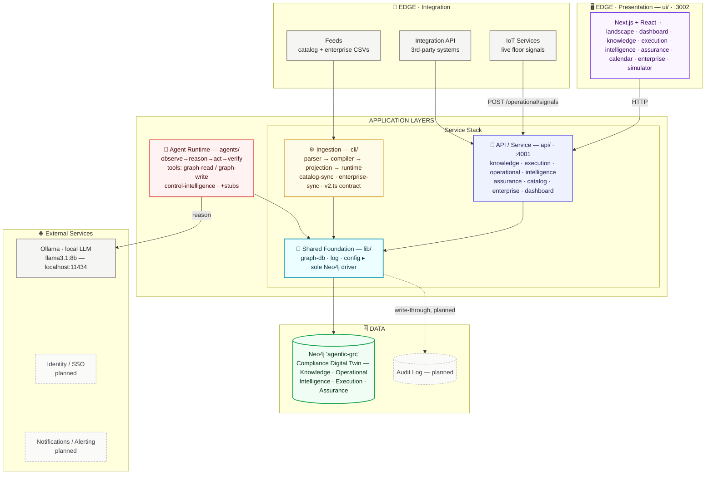

# Vyra Architecture

**The platform's layers and components — how Vyra is built.** Where `vyra-graph-spine.md` is the ground truth for *what* Vyra stores (the graph model), this document is the ground truth for *how the software is layered around it*: the runtime components, who talks to whom, and the access rules that keep the layers honest.

> Companion docs: `vyra-foundation.md` (the capability specification — model, value, guarantees), `vyra-graph-spine.md` (the graph schema this architecture serves), `vyra-implementation-plan.md` (sequencing + build status). Full reading order: `.design/README.md`.

---

## Orientation

Vyra is a monorepo of five workspaces layered around a single **Compliance Digital Twin** (one Neo4j graph per enterprise). The layers form a strict stack: the UI reads only through the API, every component reaches the graph only through one shared data-access module, and the graph is the sole point of integration — components collaborate *through the graph*, never by calling each other directly.

The platform meets the outside world at **two edges**, with the application layers between them and its **external service dependencies** on the right:
- **Presentation edge (top)** — the human-facing boundary: the web UI, spanning the top.
- **Integration edge (left)** — the machine-facing boundary: IoT services (live floor signals), feeds (catalog + enterprise seed data), and integration APIs for third-party systems.
- **Application layers (center)** — the API/Service and Ingestion write paths and the shared `lib/graph-db` foundation, with the **Agent Runtime** on the right within the same band.
- **External services (right)** — stacked to the right of the app layers: the agents reason against a **local Ollama LLM** (no API key, no cloud dependency — runs on the same machine); identity/SSO and notifications are planned integrations, not yet built.

Two write paths feed the twin, and they are deliberately different in character:
- **Batch ingestion** (`cli/`) — CSV → Neo4j `LOAD CSV`, run on demand to seed and re-sync the catalog and enterprise context.
- **Live runtime** (`api/`, `agents/`) — direct, per-event graph writes for operational signals and agent recommendations.

Everything below the API — the agent runtime, the ingestion pipeline, the API itself — funnels through **`lib/graph-db`**, the only module that holds a Neo4j driver handle.

---

## Layers at a Glance

| Layer | Workspace | Port | Components | Talks to |
|---|---|---|---|---|
| **Presentation** | `ui/` | 3002 | Next.js + React feature views — `landscape`, `dashboard`, `knowledge`, `execution`, `intelligence`, `assurance`, `calendar`, `validation`, `enterprise`, `simulator` | API (HTTP) only — **never** Neo4j |
| **API / Service** | `api/` | 4001 | Fastify; domain modules — `knowledge`, `execution`, `operational`, `intelligence`, `assurance`, `catalog`, `enterprise`, `dashboard` | `lib/graph-db` |
| **Agent Runtime** | `agents/` | — | `runtime` (observe→reason→act→verify loop + `reasonWithLLM` helper), `tools` (graph-read / graph-write), agent families — `control-intelligence` (live), `risk-`/`signal-`/`assurance-intelligence` (stubs) | `lib/graph-db` + local Ollama (`localhost:11434`) — **never** the API |
| **Ingestion** | `cli/` | — | Pipeline: `parser` → `compiler` → `projection` → `runtime`; orchestrators `index.ts` / `catalog-sync.ts` / `enterprise-sync.ts`; `semantic-contract/v2.ts` (column→node contract); `scripts/` (converters, backfill) | `lib/graph-db` (via `LOAD CSV`) |
| **Shared Foundation** | `lib/` | — | `graph-db` (sole Neo4j driver), `log`, `config` — **built before all others** | Neo4j |
| **Data / Graph** | Neo4j `agentic-grc` | — | The five-domain Compliance Digital Twin — see `vyra-graph-spine.md` | — |

**Access rules (the invariants):**
- The **UI never touches Neo4j** — all reads go through the API over HTTP.
- **`lib/graph-db` is the only door to Neo4j** — API, agents, and CLI all go through it; nothing else holds a driver.
- **Agents never call the API**, and the API never calls agents — they meet only in the graph.
- **The graph is the integration bus** — a change lands in its owner's sub-graph and propagates through relationships (see `vyra-graph-spine.md` §3.3).

---

## The Layered Architecture — As Built Today

**Reading the diagram:**
- **Two edges, a central spine, and external services.** The **Presentation edge** spans the **top** (human boundary); the **Integration edge** runs down the **left** (machine boundary — IoT signals, seed feeds, third-party APIs); the **application layers** form the **center** — the core service stack (API → Ingestion → Foundation) top-to-bottom with the **Agent Runtime** to its right in the same band; and **External Services** stack vertically on the **right**.
- **Where each edge lands:** UI and third-party/IoT traffic enter through the **API**; seed feeds enter through **Ingestion**. Together with the agents, these are the write paths into the twin — none writes into another's territory; the graph carries the consequence forward.
- **`lib/graph-db` is the single door to Neo4j** — API, ingestion, and agents all pass through it; nothing else holds a driver.
- **Agents reason against a local Ollama LLM** (right) but persist only into the graph, under Autonomy Level 1 (propose, human approves). Ollama runs on the same machine — no API key, no outbound cloud call, unlike a hosted model provider. **Identity/SSO** and **Notifications** are drawn dashed — planned external integrations, not yet built.
- **A planned Audit Log** sits beside the twin, also dashed — today every write lands only in the mutable twin via a bare `session.run()`; the write-through audit trail is target architecture, detailed under **Target Architecture — Persistence** below.

---

## Target Architecture — What Scale Requires

> This half of the document describes **target design, not built state** — the mechanisms `vyra-foundation.md` requires (per-enterprise isolation, coordinated multi-agent reasoning, a real human-in-the-loop gate, versioned/audited persistence, and the two centrally-held assets) but that don't exist in code today. Every subsection states plainly what exists instead. Sequencing, phasing, and open decisions for building any of this live in `vyra-implementation-plan.md`, not here — this section only fixes the shape.

### New Components at a Glance

| Component | Lives in | Talks to | Status |
|---|---|---|---|
| Access Gateway | `api/` (new Fastify plugin, before domain modules) | Tenant Registry, domain modules | target |
| Tenant Context | `api/` (per-request) | Access Gateway, repo layer | target |
| Tenant Registry | Vyra Central | Access Gateway, Tenant Provisioner | target |
| Tenant Provisioner | Vyra Central / ops tooling | `lib/graph-db`'s `DB.createDB()` (already exists), Catalog Sync Service, Tenant Registry | target — reuses existing code |
| Agent Registry | `agents/registry.ts` | Agent Coordinator | partially live — static array today |
| Coordination Ledger | tenant twin (graph-native `WorkItem` nodes) | Agent Coordinator, agent families | target |
| Optimistic Concurrency Guard | `lib/graph-db` / repo layer | every agent-family write | target |
| Reasoning Broker | `agents/` | Ollama, agent families | target |
| Agent Coordinator | `agents/` (replaces `scheduler.ts`) | Coordination Ledger, Reasoning Broker | target |
| Decision Watchdog | `agents/` or `api/` | `Decision` nodes, Notification Gateway | target |
| Notification Gateway | new `lib/notify` | Decision Watchdog, UI | target |
| Decision Feed | `api/` (WebSocket/SSE) | `ui/` | target |
| Unit of Work | `lib/graph-db` | every multi-statement write caller | target |
| Audit Writer | `lib/graph-db` (wraps `exec`/`exec2`) | append-only per-tenant audit database | target |
| Master Catalog | Vyra Central | Catalog Sync Service | target |
| Catalog Sync Service | Vyra Central (evolves `cli/orchestration/catalog-sync.ts`) | Master Catalog, tenant twins | partially live — same-DB today |
| Sync Diff Engine | Vyra Central, inside Catalog Sync Service | Master Catalog, tenant twins | target |
| Collective Intelligence Store | Vyra Central | Corroboration Gate, tenant twins | target |
| Corroboration Gate | Vyra Central | tenant twins, Collective Intelligence Store | target |
| Entitlement Store | Vyra Central | Access Gateway, Usage Metering | target |
| Usage Metering | Vyra Central (read-only) | Audit Writer, `SyncRun` records | target |
| Onboarding Agent Family | `agents/` (`onboarding-intelligence`) | `Blueprint`/`CutoverCriterion`/`ContinuityBaseline` (pending `vyra-graph-spine.md` ratification) | target |

---

### 1. Tenant Boundary — Edge, Identity & Provisioning

> **Status: target design — 0% built.** What exists today instead: a single hardcoded `config.db.twin.database` value (env `DB_NAME`, default `agentic-grc`) used by every caller in `api/`, `agents/`, and `cli/`; `api/API.ts` registers only CORS — no authentication or authorization of any kind.

Two problems are conflated in "no edge layer" and need separate treatment:

- **Identity & access** — who is calling, as which actor, with which permissions. Owned by a new **Access Gateway**: a Fastify plugin registered in `api/API.ts` ahead of every domain module, validating the caller (AuthN) and their role (AuthZ) against the foundation's unified `Actor`/`Role` model, and attaching a resolved **Tenant Context** (`tenantId`, `database`, `actorId`, roles, entitlements) to the request — the object that replaces every hardcoded `config.db.twin.database` reference in `api/modules/*/repo.ts`, `agents/tools/graph-*.ts`, and `cli/orchestration/*.ts`.
- **Tenant resolution & provisioning** — which enterprise's graph a request or job runs against, and how a new enterprise gets one in the first place. Owned by a **Tenant Registry** (central record of `Tenant {id, databaseName, credentialsRef, status}`, living in Vyra Central) and a **Tenant Provisioner** that creates a new tenant end to end: call out explicitly that the provisioner's core dependency — a named, per-tenant Neo4j database — is **not a gap**; `lib/graph-db/index.ts` already exposes `DB.createDB()` and a `Map<string, Driver>` keyed by database name. No caller uses either today. Wiring the Access Gateway and Tenant Provisioner to this existing mechanism is closer to plumbing than to new infrastructure.

Sequencing and open decisions for building this: `vyra-implementation-plan.md`.

### 2. Agent Orchestration — Coordination Beyond the Sequential Loop

> **Status: target design — 0% built** (the orchestration layer below). What exists today: `agents/scheduler.ts` runs all four agent families sequentially in a `for...of` loop on a 60-second `setTimeout` poll, and this part is **live and correct as of Phase 9** — not a bug to fix, because a single shared Ollama model backs every agent's reasoning call and can't serve two inferences at once.

The redesign has to keep that constraint while removing the two real gaps sitting behind it: no coordination between agent families beyond "poll everything on a timer," and no conflict detection if two families would touch the same node.

- **Agent Registry** — keeps its name and file (`agents/registry.ts`), but evolves from a static array (adding a family is a code change) to a graph-backed registry: one `Actor:Agent` node per family, reusing the foundation's own "humans and agents are the same kind of assignable actor" idiom, so registering a new family becomes a graph write.
- **Coordination Ledger** — the actual coordination primitive, and deliberately graph-native rather than a new queue/broker dependency, because "the graph is the only integration bus" is a foundation non-negotiable. Modeled as `WorkItem` nodes with a **claim-lease protocol**: an agent family claims a `WorkItem` via a single conditional `MERGE`/`SET` (succeeds only `WHERE claimedBy IS NULL`), and releases it — or lets the lease expire — on completion.
- **Optimistic Concurrency Guard** — the conflict-detection mechanism that doesn't exist today: a `version` property on nodes agents write to; an agent's `act()` step carries the version it read, and the write is rejected/retried if the node has moved on.
- **Reasoning Broker** — a new component sitting only in front of Ollama, serializing *just the inference call* rather than the whole agent loop. This is what lets graph I/O (observe/act/verify) run concurrently across families while the one real hardware constraint — one local model — stays respected rather than papered over.
- **Agent Coordinator** — replaces `scheduler.ts`'s bare loop: pulls claimable `WorkItem`s from the Coordination Ledger, dispatches to registered families, routes every reasoning call through the Reasoning Broker.

<svg viewBox="0 0 848 620" xmlns="http://www.w3.org/2000/svg" role="img" aria-labelledby="agent-orch-seq-title agent-orch-seq-desc">
<title id="agent-orch-seq-title">Agent orchestration sequence</title>
<desc id="agent-orch-seq-desc">The Agent Coordinator dispatches claimable work items from the graph-native Coordination Ledger to two agent families, which observe and act on the twin concurrently but funnel their reasoning calls through a single Reasoning Broker that serializes access to the one shared Ollama model.</desc>
<rect width="848" height="620" fill="#f5f5f5"/>
<defs>
  <marker id="ao-arrow" markerWidth="8" markerHeight="6" refX="7" refY="3" orient="auto">
    <polygon points="0 0, 8 3, 0 6" fill="#4f5d75"/>
  </marker>
</defs>

<!-- actor boxes -->
<rect x="40" y="24" width="128" height="40" rx="6" fill="#f5f5f5"/>
<rect x="40" y="24" width="128" height="40" rx="6" fill="#ffffff" stroke="#2d3142" stroke-width="1"/>
<text x="104" y="46" fill="#2d3142" font-size="12" font-weight="600" font-family="'Geist', sans-serif" text-anchor="middle">Coordinator</text>
<text x="104" y="58" fill="#4f5d75" font-size="9" font-family="'Geist Mono', monospace" text-anchor="middle">agents/</text>

<rect x="200" y="24" width="128" height="40" rx="6" fill="#f5f5f5"/>
<rect x="200" y="24" width="128" height="40" rx="6" fill="rgba(45,49,66,0.05)" stroke="#4f5d75" stroke-width="1"/>
<text x="264" y="46" fill="#2d3142" font-size="12" font-weight="600" font-family="'Geist', sans-serif" text-anchor="middle">Twin</text>
<text x="264" y="58" fill="#4f5d75" font-size="9" font-family="'Geist Mono', monospace" text-anchor="middle">WorkItem ledger</text>

<rect x="360" y="24" width="128" height="40" rx="6" fill="#f5f5f5"/>
<rect x="360" y="24" width="128" height="40" rx="6" fill="#ffffff" stroke="#2d3142" stroke-width="1"/>
<text x="424" y="46" fill="#2d3142" font-size="12" font-weight="600" font-family="'Geist', sans-serif" text-anchor="middle">Family A</text>
<text x="424" y="58" fill="#4f5d75" font-size="9" font-family="'Geist Mono', monospace" text-anchor="middle">agent family</text>

<rect x="520" y="24" width="128" height="40" rx="6" fill="#f5f5f5"/>
<rect x="520" y="24" width="128" height="40" rx="6" fill="#ffffff" stroke="#2d3142" stroke-width="1"/>
<text x="584" y="46" fill="#2d3142" font-size="12" font-weight="600" font-family="'Geist', sans-serif" text-anchor="middle">Family B</text>
<text x="584" y="58" fill="#4f5d75" font-size="9" font-family="'Geist Mono', monospace" text-anchor="middle">agent family</text>

<rect x="680" y="24" width="128" height="40" rx="6" fill="#f5f5f5"/>
<rect x="680" y="24" width="128" height="40" rx="6" fill="rgba(235,108,54,0.08)" stroke="#eb6c36" stroke-width="1.2"/>
<text x="744" y="46" fill="#2d3142" font-size="12" font-weight="600" font-family="'Geist', sans-serif" text-anchor="middle">Broker</text>
<text x="744" y="58" fill="#c2551f" font-size="9" font-family="'Geist Mono', monospace" text-anchor="middle">→ ollama, serial</text>

<!-- lifelines -->
<line x1="104" y1="64" x2="104" y2="540" stroke="rgba(45,49,66,0.20)" stroke-width="1" stroke-dasharray="3,3"/>
<line x1="264" y1="64" x2="264" y2="540" stroke="rgba(45,49,66,0.20)" stroke-width="1" stroke-dasharray="3,3"/>
<line x1="424" y1="64" x2="424" y2="540" stroke="rgba(45,49,66,0.20)" stroke-width="1" stroke-dasharray="3,3"/>
<line x1="584" y1="64" x2="584" y2="540" stroke="rgba(45,49,66,0.20)" stroke-width="1" stroke-dasharray="3,3"/>
<line x1="744" y1="64" x2="744" y2="540" stroke="rgba(45,49,66,0.20)" stroke-width="1" stroke-dasharray="3,3"/>

<!-- activation bars -->
<rect x="420" y="172" width="8" height="296" fill="rgba(45,49,66,0.06)" stroke="#4f5d75" stroke-width="0.8"/>
<rect x="580" y="208" width="8" height="296" fill="rgba(45,49,66,0.06)" stroke="#4f5d75" stroke-width="0.8"/>
<rect x="740" y="316" width="8" height="44" fill="rgba(235,108,54,0.08)" stroke="#eb6c36" stroke-width="0.8"/>
<rect x="740" y="388" width="8" height="44" fill="rgba(235,108,54,0.08)" stroke="#eb6c36" stroke-width="0.8"/>

<!-- m1 COORD -> TWIN : FIND WORK -->
<line x1="104" y1="100" x2="264" y2="100" stroke="#4f5d75" stroke-width="1.2" marker-end="url(#ao-arrow)"/>
<rect x="140" y="80" width="88" height="12" rx="2" fill="#f5f5f5"/>
<text x="184" y="89" fill="#4f5d75" font-size="8" font-family="'Geist Mono', monospace" text-anchor="middle" letter-spacing="0.06em">FIND WORK</text>

<!-- m2 TWIN --> COORD : CLAIMABLE (dashed return) -->
<line x1="264" y1="136" x2="104" y2="136" stroke="#4f5d75" stroke-width="1.2" stroke-dasharray="5,4" marker-end="url(#ao-arrow)"/>
<rect x="140" y="116" width="88" height="12" rx="2" fill="#f5f5f5"/>
<text x="184" y="125" fill="#7a8399" font-size="8" font-family="'Geist Mono', monospace" text-anchor="middle" letter-spacing="0.06em">CLAIMABLE</text>

<!-- m3 COORD -> FAM_A : DISPATCH A -->
<line x1="104" y1="172" x2="424" y2="172" stroke="#4f5d75" stroke-width="1.2" marker-end="url(#ao-arrow)"/>
<rect x="220" y="152" width="88" height="12" rx="2" fill="#f5f5f5"/>
<text x="264" y="161" fill="#4f5d75" font-size="8" font-family="'Geist Mono', monospace" text-anchor="middle" letter-spacing="0.06em">DISPATCH A</text>

<!-- m4 COORD -> FAM_B : DISPATCH B -->
<line x1="104" y1="208" x2="584" y2="208" stroke="#4f5d75" stroke-width="1.2" marker-end="url(#ao-arrow)"/>
<rect x="300" y="188" width="88" height="12" rx="2" fill="#f5f5f5"/>
<text x="344" y="197" fill="#4f5d75" font-size="8" font-family="'Geist Mono', monospace" text-anchor="middle" letter-spacing="0.06em">DISPATCH B</text>

<!-- m5 FAM_A -> TWIN : CLAIM -->
<line x1="424" y1="244" x2="264" y2="244" stroke="#4f5d75" stroke-width="1.2" marker-end="url(#ao-arrow)"/>
<rect x="300" y="224" width="88" height="12" rx="2" fill="#f5f5f5"/>
<text x="344" y="233" fill="#4f5d75" font-size="8" font-family="'Geist Mono', monospace" text-anchor="middle" letter-spacing="0.06em">CLAIM A</text>

<!-- m6 FAM_B -> TWIN : CLAIM -->
<line x1="584" y1="280" x2="264" y2="280" stroke="#4f5d75" stroke-width="1.2" marker-end="url(#ao-arrow)"/>
<rect x="380" y="260" width="88" height="12" rx="2" fill="#f5f5f5"/>
<text x="424" y="269" fill="#4f5d75" font-size="8" font-family="'Geist Mono', monospace" text-anchor="middle" letter-spacing="0.06em">CLAIM B</text>

<!-- m7 FAM_A -> BROKER : REASON A -->
<line x1="424" y1="316" x2="744" y2="316" stroke="#4f5d75" stroke-width="1.2" marker-end="url(#ao-arrow)"/>
<rect x="540" y="296" width="88" height="12" rx="2" fill="#f5f5f5"/>
<text x="584" y="305" fill="#4f5d75" font-size="8" font-family="'Geist Mono', monospace" text-anchor="middle" letter-spacing="0.06em">REASON A</text>

<!-- m8 BROKER --> FAM_A : RESULT A -->
<line x1="744" y1="352" x2="424" y2="352" stroke="#4f5d75" stroke-width="1.2" stroke-dasharray="5,4" marker-end="url(#ao-arrow)"/>
<rect x="540" y="332" width="88" height="12" rx="2" fill="#f5f5f5"/>
<text x="584" y="341" fill="#7a8399" font-size="8" font-family="'Geist Mono', monospace" text-anchor="middle" letter-spacing="0.06em">RESULT A</text>

<!-- m9 FAM_B -> BROKER : REASON B -->
<line x1="584" y1="388" x2="744" y2="388" stroke="#4f5d75" stroke-width="1.2" marker-end="url(#ao-arrow)"/>
<rect x="620" y="368" width="88" height="12" rx="2" fill="#f5f5f5"/>
<text x="664" y="377" fill="#4f5d75" font-size="8" font-family="'Geist Mono', monospace" text-anchor="middle" letter-spacing="0.06em">REASON B</text>

<!-- m10 BROKER --> FAM_B : RESULT B -->
<line x1="744" y1="424" x2="584" y2="424" stroke="#4f5d75" stroke-width="1.2" stroke-dasharray="5,4" marker-end="url(#ao-arrow)"/>
<rect x="620" y="404" width="88" height="12" rx="2" fill="#f5f5f5"/>
<text x="664" y="413" fill="#7a8399" font-size="8" font-family="'Geist Mono', monospace" text-anchor="middle" letter-spacing="0.06em">RESULT B</text>

<!-- m11 FAM_A -> TWIN : RELEASE A (version-checked act) -->
<line x1="424" y1="460" x2="264" y2="460" stroke="#4f5d75" stroke-width="1.2" marker-end="url(#ao-arrow)"/>
<rect x="300" y="440" width="88" height="12" rx="2" fill="#f5f5f5"/>
<text x="344" y="449" fill="#4f5d75" font-size="8" font-family="'Geist Mono', monospace" text-anchor="middle" letter-spacing="0.06em">RELEASE A</text>

<!-- m12 FAM_B -> TWIN : RELEASE B -->
<line x1="584" y1="496" x2="264" y2="496" stroke="#4f5d75" stroke-width="1.2" marker-end="url(#ao-arrow)"/>
<rect x="380" y="476" width="88" height="12" rx="2" fill="#f5f5f5"/>
<text x="424" y="485" fill="#4f5d75" font-size="8" font-family="'Geist Mono', monospace" text-anchor="middle" letter-spacing="0.06em">RELEASE B</text>

<!-- legend -->
<line x1="40" y1="556" x2="808" y2="556" stroke="rgba(45,49,66,0.10)" stroke-width="0.8"/>
<text x="40" y="576" fill="#4f5d75" font-size="8" font-family="'Geist Mono', monospace" letter-spacing="0.14em">LEGEND</text>
<line x1="120" y1="573" x2="148" y2="573" stroke="#4f5d75" stroke-width="1.2" marker-end="url(#ao-arrow)"/>
<text x="156" y="576" fill="#4f5d75" font-size="9" font-family="'Geist', sans-serif">call</text>
<line x1="200" y1="573" x2="228" y2="573" stroke="#4f5d75" stroke-width="1.2" stroke-dasharray="5,4" marker-end="url(#ao-arrow)"/>
<text x="236" y="576" fill="#4f5d75" font-size="9" font-family="'Geist', sans-serif">return</text>
<rect x="300" y="566" width="16" height="14" rx="2" fill="rgba(235,108,54,0.08)" stroke="#eb6c36" stroke-width="1"/>
<text x="324" y="576" fill="#4f5d75" font-size="9" font-family="'Geist', sans-serif">serialization point (Reasoning Broker)</text>
</svg>

**Reading the diagram:** graph reads happen in parallel across families — `CLAIM` covers both the conditional-`MERGE` claim and the observe read, `RELEASE` covers the version-checked write and lease release. Only the Ollama inference step (`REASON`/`RESULT`) is forced serial, through the Reasoning Broker (coral, the one new component) — everything else in the loop is free to run concurrently once the Coordination Ledger and version checks exist.

Sequencing and open decisions for building this: `vyra-implementation-plan.md`.

### 3. Human-in-the-Loop — Decision Lifecycle, SLA & Notification

> **Status: target design — 0% built** (notification/SLA). What exists today: `POST /intelligence/decisions/:id/{approve,reject}` (live, Phase 7) — a correct but purely **pull** mechanism. A full-repo search confirms zero email, webhook, websocket, or pub/sub code exists anywhere in this repository.

- **Decision Watchdog** — scans `pending` Decisions against a new `dueBy` property (set at proposal time) and flips state to `decision-overdue` once it elapses — the same alarm-state idiom `vyra-foundation.md` already uses for onboarding's `cutover-overdue`, applied to the smaller unit of a single Decision.
- **Notification Gateway** — a new `lib/notify` module, a sibling to `lib/graph-db` and `lib/log`, exposing one channel-agnostic `notify(event)` call with pluggable email/webhook/websocket adapters underneath.
- **Decision Feed** — a push channel (WebSocket or SSE) from `api/` to `ui/`, replacing the current implicit assumption that a human happens to open `/intelligence` and look.
- New `Decision.status` values: `decision-overdue`, and optionally `escalated` for a Decision that has been overdue long enough to page a different reviewer.

<svg viewBox="0 0 760 480" xmlns="http://www.w3.org/2000/svg" role="img" aria-labelledby="decision-lifecycle-title decision-lifecycle-desc">
<title id="decision-lifecycle-title">Decision lifecycle with SLA and escalation</title>
<desc id="decision-lifecycle-desc">A Decision starts pending after an agent proposes it under Autonomy Level 1, moves to approved or rejected on human review, or — if a dueBy time elapses unresolved — flips to decision-overdue and, if still unresolved, escalates to a different reviewer before reaching the same approved or rejected outcomes.</desc>
<rect width="760" height="480" fill="#f5f5f5"/>
<defs>
  <marker id="dl-arrow" markerWidth="8" markerHeight="6" refX="7" refY="3" orient="auto">
    <polygon points="0 0, 8 3, 0 6" fill="#4f5d75"/>
  </marker>
</defs>

<!-- boxes drawn first -->
<rect x="140" y="36" width="160" height="48" rx="8" fill="#ffffff" stroke="#2d3142" stroke-width="1"/>
<text x="220" y="64" fill="#2d3142" font-size="12" font-weight="600" font-family="'Geist', sans-serif" text-anchor="middle">pending</text>

<rect x="480" y="36" width="160" height="48" rx="8" fill="rgba(235,108,54,0.08)" stroke="#eb6c36" stroke-width="1.2"/>
<text x="560" y="64" fill="#2d3142" font-size="12" font-weight="600" font-family="'Geist', sans-serif" text-anchor="middle">approved</text>

<rect x="140" y="180" width="160" height="48" rx="8" fill="rgba(45,49,66,0.02)" stroke="rgba(45,49,66,0.30)" stroke-width="1" stroke-dasharray="4,3"/>
<text x="220" y="200" fill="#2d3142" font-size="11" font-weight="600" font-family="'Geist', sans-serif" text-anchor="middle">decision-</text>
<text x="220" y="214" fill="#2d3142" font-size="11" font-weight="600" font-family="'Geist', sans-serif" text-anchor="middle">overdue</text>

<rect x="140" y="324" width="160" height="48" rx="8" fill="rgba(45,49,66,0.02)" stroke="rgba(45,49,66,0.30)" stroke-width="1" stroke-dasharray="4,3"/>
<text x="220" y="352" fill="#2d3142" font-size="12" font-weight="600" font-family="'Geist', sans-serif" text-anchor="middle">escalated</text>

<rect x="480" y="324" width="160" height="48" rx="8" fill="#ffffff" stroke="#2d3142" stroke-width="1"/>
<text x="560" y="352" fill="#2d3142" font-size="12" font-weight="600" font-family="'Geist', sans-serif" text-anchor="middle">rejected</text>

<!-- start / end pseudostates -->
<circle cx="80" cy="60" r="6" fill="#2d3142"/>
<text x="80" y="90" fill="#4f5d75" font-size="8" font-family="'Geist Mono', monospace" text-anchor="start" letter-spacing="0.04em">L1: PROPOSES</text>

<circle cx="680" cy="60" r="8" fill="#f5f5f5" stroke="#2d3142" stroke-width="1"/>
<circle cx="680" cy="60" r="5" fill="#2d3142"/>
<circle cx="680" cy="348" r="8" fill="#f5f5f5" stroke="#2d3142" stroke-width="1"/>
<circle cx="680" cy="348" r="5" fill="#2d3142"/>

<!-- transitions -->
<!-- start -> pending -->
<line x1="86" y1="60" x2="140" y2="60" stroke="#4f5d75" stroke-width="1.2" marker-end="url(#dl-arrow)"/>

<!-- pending -> approved (straight) -->
<line x1="300" y1="60" x2="480" y2="60" stroke="#4f5d75" stroke-width="1.2" marker-end="url(#dl-arrow)"/>
<rect x="350" y="40" width="80" height="12" rx="2" fill="#f5f5f5"/>
<text x="390" y="49" fill="#4f5d75" font-size="8" font-family="'Geist Mono', monospace" text-anchor="middle" letter-spacing="0.06em">APPROVES</text>

<!-- pending -> decision-overdue (straight, vertical) -->
<line x1="220" y1="84" x2="220" y2="180" stroke="#4f5d75" stroke-width="1.2" marker-end="url(#dl-arrow)"/>
<rect x="228" y="126" width="90" height="12" rx="2" fill="#f5f5f5"/>
<text x="273" y="135" fill="#4f5d75" font-size="8" font-family="'Geist Mono', monospace" text-anchor="middle" letter-spacing="0.06em">DUEBY ELAPSED</text>

<!-- decision-overdue -> escalated (straight, vertical) -->
<line x1="220" y1="228" x2="220" y2="324" stroke="#4f5d75" stroke-width="1.2" marker-end="url(#dl-arrow)"/>
<rect x="228" y="270" width="80" height="12" rx="2" fill="#f5f5f5"/>
<text x="268" y="279" fill="#4f5d75" font-size="8" font-family="'Geist Mono', monospace" text-anchor="middle" letter-spacing="0.06em">UNRESOLVED</text>

<!-- pending -> rejected (elbow, offset port) -->
<path d="M300,76 H382 Q390,76 390,84 V328 Q390,336 398,336 H480" fill="none" stroke="#4f5d75" stroke-width="1.2" marker-end="url(#dl-arrow)"/>
<rect x="358" y="200" width="64" height="12" rx="2" fill="#f5f5f5"/>
<text x="390" y="209" fill="#4f5d75" font-size="8" font-family="'Geist Mono', monospace" text-anchor="middle" letter-spacing="0.06em">REJECTS</text>

<!-- escalated -> approved (elbow, offset port) -->
<path d="M300,336 H402 Q410,336 410,328 V80 Q410,72 418,72 H480" fill="none" stroke="#4f5d75" stroke-width="1.2" marker-end="url(#dl-arrow)"/>
<rect x="370" y="198" width="80" height="12" rx="2" fill="#f5f5f5"/>
<text x="410" y="207" fill="#4f5d75" font-size="8" font-family="'Geist Mono', monospace" text-anchor="middle" letter-spacing="0.06em">APPROVES</text>

<!-- escalated -> rejected (straight) -->
<line x1="300" y1="348" x2="480" y2="348" stroke="#4f5d75" stroke-width="1.2" marker-end="url(#dl-arrow)"/>
<rect x="358" y="328" width="64" height="12" rx="2" fill="#f5f5f5"/>
<text x="390" y="337" fill="#4f5d75" font-size="8" font-family="'Geist Mono', monospace" text-anchor="middle" letter-spacing="0.06em">REJECTS</text>

<!-- approved / rejected -> end -->
<line x1="640" y1="60" x2="672" y2="60" stroke="#4f5d75" stroke-width="1.2" marker-end="url(#dl-arrow)"/>
<line x1="640" y1="348" x2="672" y2="348" stroke="#4f5d75" stroke-width="1.2" marker-end="url(#dl-arrow)"/>

<!-- legend -->
<line x1="40" y1="416" x2="720" y2="416" stroke="rgba(45,49,66,0.10)" stroke-width="0.8"/>
<text x="40" y="436" fill="#4f5d75" font-size="8" font-family="'Geist Mono', monospace" letter-spacing="0.14em">LEGEND</text>
<rect x="120" y="426" width="16" height="14" rx="2" fill="#ffffff" stroke="#2d3142" stroke-width="1"/>
<text x="144" y="436" fill="#4f5d75" font-size="9" font-family="'Geist', sans-serif">live path (Phase 7)</text>
<rect x="290" y="426" width="16" height="14" rx="2" fill="rgba(45,49,66,0.02)" stroke="rgba(45,49,66,0.30)" stroke-width="1" stroke-dasharray="4,3"/>
<text x="314" y="436" fill="#4f5d75" font-size="9" font-family="'Geist', sans-serif">target — unresolved / alarm state</text>
<rect x="540" y="426" width="16" height="14" rx="2" fill="rgba(235,108,54,0.08)" stroke="#eb6c36" stroke-width="1.2"/>
<text x="564" y="436" fill="#4f5d75" font-size="9" font-family="'Geist', sans-serif">happy completion</text>
</svg>

**Reading the diagram:** `pending → approved/rejected` (solid boxes) is the live Phase 7 path. `decision-overdue`/`escalated` (dashed) are target — a Decision can sit in `pending` indefinitely today with no alarm.

Sequencing and open decisions for building this: `vyra-implementation-plan.md`.

### 4. Persistence — Transactions, Audit & Versioning

> **Status: target design — 0% built.** What exists today: `lib/graph-db`'s `db` interface (`fetch`/`fetch2`/`exec`/`exec2`) issues one bare `session.run()` per call, with no multi-statement transaction and no retry; `cli/runtime/repo.ts`'s `loadNodes` writes `MERGE ... ON CREATE/ON MATCH SET n += row` — an idempotent overwrite-by-id with no history. `supersededBy` exists on exactly one node type, `Regulation`.

- **Unit of Work** — a new `transact(fn)` method on the `db` interface, wrapping `session.executeWrite`, for any logical operation that spans more than one Cypher statement (e.g. a Decision approval that creates a `Risk` node and its edges in one step) — replacing today's sequences of independent, non-atomic `exec()` calls.
- **Audit Writer** — a write-through wrapper around every mutating `exec`/`exec2` call, emitting an immutable `AuditEvent {actor, action, targetId, before, after, ts}` record. Two placements are possible; this doc recommends one:
  - *(a)* graph-native `AuditEvent` nodes inside the tenant's own twin — keeps everything on one integration bus, but bloats the twin with write-history it doesn't need for reasoning.
  - *(b, recommended)* a second, append-only database per tenant (e.g. `<tenant>-audit`), opened through the *same already-existing* `DB.get(name, credentials)` multi-driver mechanism in `lib/graph-db` that Tenant Provisioning (§1) also depends on — no new infrastructure, and the mutable twin stays lean.
- **Append-and-Supersede Protocol** — the name for the pattern `vyra-foundation.md` already requires ("nothing is deleted, only superseded"), enforced at the Audit Writer / repo layer rather than as a Neo4j schema constraint (Cypher has no native "supersede, don't overwrite" guard). Which node types beyond `Regulation` must carry a `supersededBy` property is `vyra-graph-spine.md`'s decision, not this document's — architecture only fixes *where in the write path* the protocol is enforced.

| Mechanism | Today | Target |
|---|---|---|
| Multi-statement atomicity | none — independent `exec()` calls | `Unit of Work.transact(fn)` |
| Write history | none — `MERGE...SET` overwrites in place | `Audit Writer` → append-only audit database |
| Supersession | `Regulation.supersededBy` only | Append-and-Supersede Protocol, scope set by `vyra-graph-spine.md` |

Sequencing and open decisions for building this: `vyra-implementation-plan.md`.

### 5. Vyra Central — Topology, Catalog Distribution & Collective Intelligence

> **Status:** Catalog Sync itself is **live** (Phase 1, real data) but writes into the *same* tenant database under a `:Catalog` label — not the physically separate "one master, many synced copies" split `vyra-foundation.md` §1 requires. Collective Intelligence, entitlement, and metering have **zero architectural footprint today**. `vyra-implementation-plan.md` already flags this open item in almost the same words used here: *"There's no separate 'master catalog' service today... Don't design against that split until it's explicitly scoped."*

- **Vyra Central** — the deployment boundary itself: one shared service, distinct from any tenant's deployment, holding everything below.
- **Master Catalog** — the central, versioned `Regulation/Clause/Requirement/Control` store. Target: its own database (e.g. `vyra-catalog-master`), reusing the multi-driver mechanism again rather than colocating with any tenant.
- **Catalog Sync Service** — the evolution of `cli/orchestration/catalog-sync.ts`: Master Catalog → **Sync Diff Engine** → fan-out into every tenant database, instead of reading local CSVs into whichever database happens to be configured.
- **Sync Diff Engine** — computes a real diff instead of today's blind `MERGE...SET n += row` overwrite, which is what actually makes `vyra-foundation.md`'s "customization survives re-sync" and "freshness as a measurable SLA" requirements checkable rather than aspirational.
- **`SyncRun`** — a new provenance node (`id, sourceCatalogVersion, startedAt, completedAt, nodesWritten, diffSummary`) — the sync-run audit trail that doesn't exist today (only a bare `catalogVersion` property does).
- **Collective Intelligence Store** — the central store of corroborated, identifier-free `TypedPattern` objects per `vyra-foundation.md` §3.
- **Corroboration Gate** — gives the foundation doc's "corroboration" concept an actual place: a Vyra Central service that accepts pattern submissions from tenants and only promotes one into the Collective Intelligence Store once corroborated across N unrelated tenants.
- **Entitlement Store** — tenant licensing (catalog scope, jurisdictions, agent families, collective-intelligence participation) as graph state, per `vyra-foundation.md` §4 ("entitlement is data, never a build flag").
- **Usage Metering** — deliberately *not* a new instrumentation path: a read over the Audit Writer (§4) and `SyncRun` records already being produced, per §4's own rule ("if billing needs its own instrumentation, the provenance model was incomplete").
- **Onboarding Agent Family** (`onboarding-intelligence`) — a fifth agent family (not in `agents/registry.ts` today) owning three new per-tenant concepts named in `vyra-foundation.md` §0: `Blueprint`, `CutoverCriterion`, `ContinuityBaseline`. This document only places them; formally defining them as graph entities is `vyra-graph-spine.md`'s decision to ratify.

<svg viewBox="0 0 800 440" xmlns="http://www.w3.org/2000/svg" role="img" aria-labelledby="vyra-central-title vyra-central-desc">
<title id="vyra-central-title">Vyra Central and tenant deployment topology</title>
<desc id="vyra-central-desc">Vyra Central holds the Tenant Registry, Master Catalog, Catalog Sync Service, Collective Intelligence Store, Corroboration Gate and Entitlement Store; each tenant deployment runs an Access Gateway in front of the API/Agents/Ingestion stack over its own Neo4j twin. Only catalog fan-out from Catalog Sync Service into the tenant stack is live today — every other cross-boundary link is target design.</desc>
<rect width="800" height="440" fill="#f5f5f5"/>
<defs>
  <marker id="vc-arrow" markerWidth="8" markerHeight="6" refX="7" refY="3" orient="auto">
    <polygon points="0 0, 8 3, 0 6" fill="#4f5d75"/>
  </marker>
</defs>

<!-- zones (bg -> zones -> arrows -> nodes) -->
<rect x="40" y="40" width="480" height="208" rx="8" fill="rgba(45,49,66,0.02)" stroke="rgba(45,49,66,0.10)" stroke-width="0.8"/>
<rect x="48" y="44" width="112" height="12" rx="2" fill="#f5f5f5"/>
<text x="104" y="53" fill="rgba(45,49,66,0.45)" font-size="7" font-family="'Geist Mono', monospace" text-anchor="middle" letter-spacing="0.14em">VYRA CENTRAL</text>

<rect x="560" y="40" width="200" height="312" rx="8" fill="rgba(45,49,66,0.02)" stroke="rgba(45,49,66,0.10)" stroke-width="0.8"/>
<rect x="568" y="44" width="152" height="12" rx="2" fill="#f5f5f5"/>
<text x="644" y="53" fill="rgba(45,49,66,0.45)" font-size="7" font-family="'Geist Mono', monospace" text-anchor="middle" letter-spacing="0.10em">TENANT DEPLOYMENT ×N</text>

<!-- edges (drawn before nodes) -->
<!-- E2 CSYNC -> STACK : fan-out, live -->
<path d="M496,116 H530 Q538,116 538,124 V180 Q538,188 546,188 H580" fill="none" stroke="#4f5d75" stroke-width="1.2" marker-end="url(#vc-arrow)"/>
<rect x="502" y="146" width="72" height="12" rx="2" fill="#f5f5f5"/>
<text x="538" y="155" fill="#4f5d75" font-size="8" font-family="'Geist Mono', monospace" text-anchor="middle" letter-spacing="0.06em">FAN-OUT</text>

<!-- E3 CISTORE -> STACK : pattern feed-down, target -->
<path d="M192,184 H378 Q386,184 386,192 V192 Q386,200 394,200 H580" fill="none" stroke="#4f5d75" stroke-width="1" stroke-dasharray="4,3" marker-end="url(#vc-arrow)"/>
<rect x="249" y="164" width="72" height="12" rx="2" fill="#f5f5f5"/>
<text x="285" y="173" fill="#7a8399" font-size="8" font-family="'Geist Mono', monospace" text-anchor="middle" letter-spacing="0.06em">PATTERNS</text>

<!-- E4 STACK -> CGATE : corroboration harvest, target -->
<path d="M580,212 H470 Q462,212 462,204 V204 Q462,196 454,196 H344" fill="none" stroke="#4f5d75" stroke-width="1" stroke-dasharray="4,3" marker-end="url(#vc-arrow)"/>
<rect x="489" y="192" width="72" height="12" rx="2" fill="#f5f5f5"/>
<text x="525" y="201" fill="#7a8399" font-size="8" font-family="'Geist Mono', monospace" text-anchor="middle" letter-spacing="0.06em">HARVEST</text>

<!-- E5 STACK -> ENT : usage / metering, target -->
<path d="M580,224 H482 Q474,224 474,216 V206 Q474,198 466,198 H368" fill="none" stroke="#4f5d75" stroke-width="1" stroke-dasharray="4,3" marker-end="url(#vc-arrow)"/>
<rect x="438" y="206" width="72" height="12" rx="2" fill="#f5f5f5"/>
<text x="474" y="215" fill="#7a8399" font-size="8" font-family="'Geist Mono', monospace" text-anchor="middle" letter-spacing="0.06em">METRICS</text>

<!-- E6 TREG -> GW : tenant resolution, target (routed above row 1) -->
<path d="M128,88 V72 Q128,64 136,64 H652 Q660,64 660,72 V88" fill="none" stroke="#4f5d75" stroke-width="1" stroke-dasharray="4,3" marker-end="url(#vc-arrow)"/>
<rect x="362" y="44" width="72" height="12" rx="2" fill="#f5f5f5"/>
<text x="398" y="53" fill="#7a8399" font-size="8" font-family="'Geist Mono', monospace" text-anchor="middle" letter-spacing="0.06em">RESOLVES</text>

<!-- E1 CGATE -> CISTORE : promotes corroborated patterns, target -->
<line x1="216" y1="196" x2="192" y2="196" stroke="#4f5d75" stroke-width="1" stroke-dasharray="4,3" marker-end="url(#vc-arrow)"/>

<!-- E7 GW -> STACK : as-built -->
<line x1="660" y1="144" x2="660" y2="176" stroke="#2d3142" stroke-width="1.2" marker-end="url(#vc-arrow)"/>
<rect x="628" y="152" width="64" height="12" rx="2" fill="#f5f5f5"/>
<text x="660" y="161" fill="#4f5d75" font-size="8" font-family="'Geist Mono', monospace" text-anchor="middle" letter-spacing="0.06em">AUTHN/Z</text>

<!-- E8 STACK -> TWIN : as-built -->
<line x1="660" y1="240" x2="660" y2="272" stroke="#2d3142" stroke-width="1.2" marker-end="url(#vc-arrow)"/>

<!-- nodes -->
<!-- Tenant Registry (target) -->
<rect x="64" y="88" width="128" height="56" rx="6" fill="rgba(45,49,66,0.02)" stroke="rgba(45,49,66,0.30)" stroke-width="1" stroke-dasharray="4,3"/>
<text x="128" y="112" fill="#2d3142" font-size="12" font-weight="600" font-family="'Geist', sans-serif" text-anchor="middle">Tenant Registry</text>
<text x="128" y="128" fill="#7a8399" font-size="8" font-family="'Geist Mono', monospace" text-anchor="middle" letter-spacing="0.06em">target</text>

<!-- Master Catalog (target) -->
<rect x="216" y="88" width="128" height="56" rx="6" fill="rgba(45,49,66,0.02)" stroke="rgba(45,49,66,0.30)" stroke-width="1" stroke-dasharray="4,3"/>
<text x="280" y="112" fill="#2d3142" font-size="12" font-weight="600" font-family="'Geist', sans-serif" text-anchor="middle">Master Catalog</text>
<text x="280" y="128" fill="#7a8399" font-size="8" font-family="'Geist Mono', monospace" text-anchor="middle" letter-spacing="0.06em">target</text>

<!-- Catalog Sync Service (partially live) -->
<rect x="368" y="88" width="128" height="56" rx="6" fill="rgba(45,49,66,0.05)" stroke="#4f5d75" stroke-width="1"/>
<text x="432" y="108" fill="#2d3142" font-size="12" font-weight="600" font-family="'Geist', sans-serif" text-anchor="middle">Catalog Sync</text>
<text x="432" y="122" fill="#2d3142" font-size="12" font-weight="600" font-family="'Geist', sans-serif" text-anchor="middle">+ Diff Engine</text>
<text x="432" y="135" fill="#4f5d75" font-size="8" font-family="'Geist Mono', monospace" text-anchor="middle" letter-spacing="0.06em">same-db today</text>

<!-- Collective Intelligence Store (target) -->
<rect x="64" y="168" width="128" height="56" rx="6" fill="rgba(45,49,66,0.02)" stroke="rgba(45,49,66,0.30)" stroke-width="1" stroke-dasharray="4,3"/>
<text x="128" y="188" fill="#2d3142" font-size="12" font-weight="600" font-family="'Geist', sans-serif" text-anchor="middle">Collective</text>
<text x="128" y="202" fill="#2d3142" font-size="12" font-weight="600" font-family="'Geist', sans-serif" text-anchor="middle">Intelligence Store</text>
<text x="128" y="215" fill="#7a8399" font-size="8" font-family="'Geist Mono', monospace" text-anchor="middle" letter-spacing="0.06em">target</text>

<!-- Corroboration Gate (focal) -->
<rect x="216" y="168" width="128" height="56" rx="6" fill="rgba(235,108,54,0.08)" stroke="#eb6c36" stroke-width="1.2"/>
<text x="280" y="192" fill="#2d3142" font-size="12" font-weight="600" font-family="'Geist', sans-serif" text-anchor="middle">Corroboration</text>
<text x="280" y="206" fill="#2d3142" font-size="12" font-weight="600" font-family="'Geist', sans-serif" text-anchor="middle">Gate</text>
<text x="280" y="219" fill="#c2551f" font-size="8" font-family="'Geist Mono', monospace" text-anchor="middle" letter-spacing="0.06em">target — isolation gate</text>

<!-- Entitlement Store (target) -->
<rect x="368" y="168" width="128" height="56" rx="6" fill="rgba(45,49,66,0.02)" stroke="rgba(45,49,66,0.30)" stroke-width="1" stroke-dasharray="4,3"/>
<text x="432" y="192" fill="#2d3142" font-size="12" font-weight="600" font-family="'Geist', sans-serif" text-anchor="middle">Entitlement</text>
<text x="432" y="206" fill="#2d3142" font-size="12" font-weight="600" font-family="'Geist', sans-serif" text-anchor="middle">Store</text>
<text x="432" y="219" fill="#7a8399" font-size="8" font-family="'Geist Mono', monospace" text-anchor="middle" letter-spacing="0.06em">target</text>

<!-- Access Gateway (target) -->
<rect x="580" y="88" width="160" height="56" rx="6" fill="rgba(45,49,66,0.02)" stroke="rgba(45,49,66,0.30)" stroke-width="1" stroke-dasharray="4,3"/>
<text x="660" y="112" fill="#2d3142" font-size="12" font-weight="600" font-family="'Geist', sans-serif" text-anchor="middle">Access Gateway</text>
<text x="660" y="128" fill="#7a8399" font-size="8" font-family="'Geist Mono', monospace" text-anchor="middle" letter-spacing="0.06em">target</text>

<!-- Stack: API / Agents / Ingestion / lib/graph-db (as-built) -->
<rect x="580" y="176" width="160" height="64" rx="6" fill="#ffffff" stroke="#2d3142" stroke-width="1"/>
<text x="660" y="200" fill="#2d3142" font-size="12" font-weight="600" font-family="'Geist', sans-serif" text-anchor="middle">API · Agents ·</text>
<text x="660" y="214" fill="#2d3142" font-size="12" font-weight="600" font-family="'Geist', sans-serif" text-anchor="middle">Ingestion</text>
<text x="660" y="230" fill="#4f5d75" font-size="8" font-family="'Geist Mono', monospace" text-anchor="middle" letter-spacing="0.04em">see As-Built above</text>

<!-- Neo4j Twin (as-built store) -->
<rect x="580" y="272" width="160" height="56" rx="6" fill="rgba(45,49,66,0.05)" stroke="#4f5d75" stroke-width="1"/>
<text x="660" y="296" fill="#2d3142" font-size="12" font-weight="600" font-family="'Geist', sans-serif" text-anchor="middle">Neo4j Twin</text>
<text x="660" y="312" fill="#4f5d75" font-size="8" font-family="'Geist Mono', monospace" text-anchor="middle" letter-spacing="0.06em">agentic-grc</text>

<!-- legend -->
<line x1="40" y1="376" x2="760" y2="376" stroke="rgba(45,49,66,0.10)" stroke-width="0.8"/>
<text x="40" y="396" fill="#4f5d75" font-size="8" font-family="'Geist Mono', monospace" letter-spacing="0.14em">LEGEND</text>
<line x1="120" y1="393" x2="148" y2="393" stroke="#2d3142" stroke-width="1.2" marker-end="url(#vc-arrow)"/>
<text x="156" y="396" fill="#4f5d75" font-size="9" font-family="'Geist', sans-serif">live today</text>
<line x1="260" y1="393" x2="288" y2="393" stroke="#4f5d75" stroke-width="1" stroke-dasharray="4,3" marker-end="url(#vc-arrow)"/>
<text x="296" y="396" fill="#4f5d75" font-size="9" font-family="'Geist', sans-serif">target — not built</text>
<rect x="460" y="386" width="16" height="14" rx="2" fill="rgba(45,49,66,0.02)" stroke="rgba(45,49,66,0.30)" stroke-width="1" stroke-dasharray="4,3"/>
<text x="484" y="396" fill="#4f5d75" font-size="9" font-family="'Geist', sans-serif">target component</text>
<rect x="620" y="386" width="16" height="14" rx="2" fill="rgba(235,108,54,0.08)" stroke="#eb6c36" stroke-width="1.2"/>
<text x="644" y="396" fill="#4f5d75" font-size="9" font-family="'Geist', sans-serif">isolation-critical</text>
</svg>

**Reading the diagram:** the solid `FAN-OUT` link is the one connection that's partially real today (catalog sync, though same-database rather than cross-database as drawn); every dashed link — pattern feed-down, corroboration harvest, metering, tenant resolution, and `CGATE → CISTORE`'s own promotion step — is fully target. The Corroboration Gate (coral) is the isolation-critical node: `vyra-foundation.md` §3 names it as the one place the no-customer-data-leaves-the-tenant guarantee could quietly break.

Sequencing and open decisions for building this: `vyra-implementation-plan.md`.
