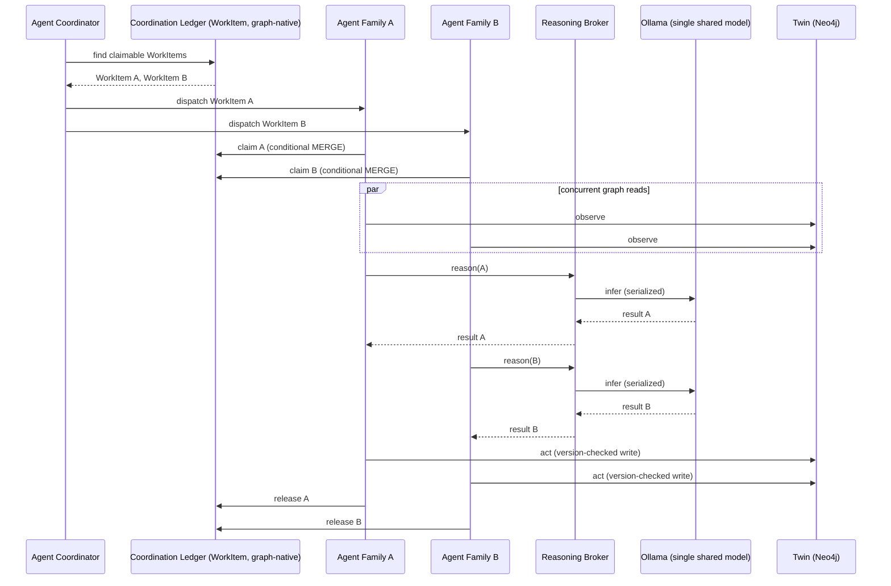
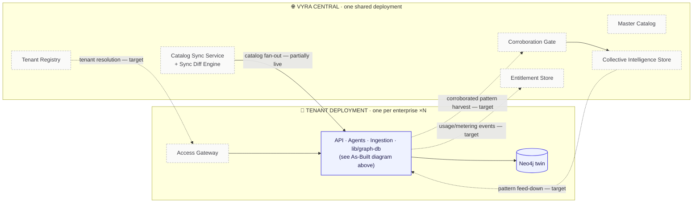

# Vyra Architecture

**The platform's layers and components — how Vyra is built.** Where `vyra-graph-spine.md` is the ground truth for *what* Vyra stores (the graph model), this document is the ground truth for *how the software is layered around it*: the runtime components, who talks to whom, and the access rules that keep the layers honest.

> Companion docs: `vyra-foundation.md` (the capability specification — model, value, guarantees), `vyra-graph-spine.md` (the graph schema this architecture serves), `vyra-implementation-plan.md` (sequencing + build status). Full reading order: `.design/README.md`.

---

## Orientation

Vyra is a monorepo of five workspaces layered around a single **Compliance Digital Twin** (one Neo4j graph per enterprise). The layers form a strict stack: the UI reads only through the API, every component reaches the graph only through one shared data-access module, and the graph is the sole point of integration — components collaborate *through the graph*, never by calling each other directly.

The platform meets the outside world at **two edges**, with the application layers between them and its **external service dependencies** on the right:
- **Presentation edge (top)** — the human-facing boundary: the web UI, spanning the top.
- **Integration edge (left)** — the machine-facing boundary: IoT services (live floor signals), feeds (catalog + enterprise seed data), and integration APIs for third-party systems.
- **Application layers (center)** — the API/Service and Ingestion write paths and the shared `lib/graph-db` foundation, with the **Agent Runtime** on the right within the same band.
- **External services (right)** — stacked to the right of the app layers: the agents reason against a **local Ollama LLM** (no API key, no cloud dependency — runs on the same machine); identity/SSO and notifications are planned integrations, not yet built.

Two write paths feed the twin, and they are deliberately different in character:
- **Batch ingestion** (`cli/`) — CSV → Neo4j `LOAD CSV`, run on demand to seed and re-sync the catalog and enterprise context.
- **Live runtime** (`api/`, `agents/`) — direct, per-event graph writes for operational signals and agent recommendations.

Everything below the API — the agent runtime, the ingestion pipeline, the API itself — funnels through **`lib/graph-db`**, the only module that holds a Neo4j driver handle.

---

## Context Map — Bounded Contexts and the Catalog/Enterprise Relationship

DDD terms, applied precisely rather than decoratively. The five graph *domains* in `vyra-graph-spine.md` are **subdomains**, not Bounded Contexts — they share one physical graph, one schema, and one consistency boundary, which is the actual test for "same context." The real Bounded Context boundary in this system is the **tenant**: one Neo4j database per enterprise is one Bounded Context. Two enterprises never share a model, a query, or a transaction — that is what `vyra-foundation.md`'s "isolation of data" principle means in DDD terms.

Inside that one Bounded Context, the five subdomains stay cohesive because each has exactly one owning writer (`vyra-graph-spine.md` §3.3 — Catalog Ingester, Enterprise Sync, Events Sink, Agent Runtime) — the **Common Closure Principle** applied at graph scale: things that change for the same reason (a regulation revision, an incident) are written by the same owner, and no owner writes into another's territory.

**The one real cross-context relationship is Vyra Central ↔ Tenant, and it is asymmetric on purpose:**

| DDD relationship | Direction | Mechanism |
|---|---|---|
| **Open Host Service + Published Language** | Vyra Central → Tenant | The versioned `Regulation/Clause/Requirement/Control` catalog schema is a published contract every tenant conforms to — tenants don't negotiate or fork it |
| **Anti-Corruption Layer, reversed** | Tenant ← sync | Runs opposite to the textbook direction: it isn't protecting the tenant from a messy upstream model, it's protecting the tenant's own local extensions from being clobbered by the *next* sync. The mechanism is `vyra-foundation.md` §1's additive `MERGE ... ON MATCH SET n += row` — a write discipline, not a translation layer, because both sides already share the same node shape |
| **Separate Ways** | Enterprise subdomain ↔ Vyra Central | The Enterprise subdomain (org, roles, facilities, incidents) has no upstream dependency at all — pure tenant data, never synced anywhere today. Collective Intelligence's corroboration gate is the *planned* exception, and only for identifier-free typed patterns, never rows |

This is what makes the `:Catalog`/`:Enterprise` dual-label an architectural decision, not a schema convenience: it lets two different Context Map relationships — conform-to-upstream, and fully autonomous — coexist on the *same node type* inside one Bounded Context, told apart structurally rather than by a hidden flag.

---

## Layers at a Glance

| Layer | Workspace | Port | Components | Talks to |
|---|---|---|---|---|
| **Presentation** | `ui/` | 3002 | Next.js + React feature views — `landscape`, `dashboard`, `knowledge`, `execution`, `intelligence`, `assurance`, `calendar`, `validation`, `enterprise`, `simulator` | API (HTTP) only — **never** Neo4j |
| **API / Service** | `api/` | 4001 | Fastify; domain modules — `knowledge`, `execution`, `operational`, `intelligence`, `assurance`, `catalog`, `enterprise`, `dashboard`. Two-layer today (route → repo, no domain/validation layer) — see **Known Architectural Debt** below | `lib/graph-db` |
| **Agent Runtime** | `agents/` | — | `runtime` (observe→reason→act→verify loop + `reasonWithLLM` helper), `tools` (graph-read / graph-write), agent families — `control-intelligence` (live), `risk-`/`signal-`/`assurance-intelligence` (stubs) | `lib/graph-db` + local Ollama (`localhost:11434`) — **never** the API |
| **Ingestion** | `cli/` | — | Pipeline: `parser` → `compiler` → `projection` → `runtime`; orchestrators `index.ts` / `catalog-sync.ts` / `enterprise-sync.ts`; `semantic-contract/v2.ts` (column→node contract); `scripts/` (converters, backfill) | `lib/graph-db` (via `LOAD CSV`) |
| **Shared Foundation** | `lib/` | — | `graph-db` (sole Neo4j driver), `log`, `config` — **built before all others** | Neo4j |
| **Data / Graph** | Neo4j `agentic-grc` | — | The five-domain Compliance Digital Twin — see `vyra-graph-spine.md` | — |

**Access rules (the invariants):**
- The **UI never touches Neo4j** — all reads go through the API over HTTP.
- **`lib/graph-db` is the only door to Neo4j** — API, agents, and CLI all go through it; nothing else holds a driver.
- **Agents never call the API**, and the API never calls agents — they meet only in the graph.
- **The graph is the integration bus** — a change lands in its owner's sub-graph and propagates through relationships (see `vyra-graph-spine.md` §3.3).

---

## Applied Patterns — What's Already Correct

Naming what's already right matters as much as naming what's missing. These are load-bearing and should not be "refactored" away by anyone who doesn't recognize them:

| Pattern | Where | Why it's the right call here |
|---|---|---|
| **Repository** | `api/modules/<domain>/repo.ts` | Every Cypher query is isolated behind a repo function; callers never see a driver or a session |
| **Gateway** | `lib/graph-db` | The single translation boundary to Neo4j — nothing outside it holds a driver handle |
| **Singleton + Lazy Factory** | `DB.getInstance()` (singleton holding driver state) wrapped by `const db = () => DB.get(...)` at every call site (lazy factory) | No module pays a connection cost until it actually queries; the singleton is confined to one file, never referenced directly by callers |
| **Idempotent Receiver** | `cli/runtime/repo.ts`'s `MERGE ... ON CREATE/ON MATCH SET n += row`; every agent-family write | `./ingest.sh` is safely re-runnable and at-least-once agent polling (`agents/scheduler.ts`) can't duplicate a node |
| **Registry** (partial) | `agents/registry.ts` | A named lookup of agent families by string key — correctly a Registry today, even as a static object rather than the graph-backed version Target §2 proposes |

## Known Architectural Debt

Concrete, code-grounded gaps — named so they're tracked, not rediscovered as surprises later:

| Smell | Where | What's missing | Fix |
|---|---|---|---|
| **Edge and Service collapsed into one layer** | Every `api/modules/<domain>/index.ts` — the Fastify route handler calls `repo.ts` directly; nothing validates input or sequences domain rules between them | Node-spine's own `edge → core → repo` spine calls for a Service/Domain layer; today it's `edge → repo` — two layers, not three | Target Architecture §6, **Domain Validation Layer**, below — scoped to the 3 endpoints that actually mutate state, not all 30+ read endpoints (YAGNI: a GET has nothing to validate beyond route params) |
| **Errors silently become empty results** | The dominant pattern in `repo.ts` reads — 34 of 41 `catch` blocks across `api/modules/*/repo.ts` log the error and `return []` (or `void`) | Fail-fast (clean-code §5): a Neo4j connection failure and "genuinely zero rows" are indistinguishable to every caller, including the UI — the one thing `vyra-foundation.md` calls non-negotiable for *business* gaps ("documented absence is a first-class state") is being silently violated for *infrastructure* failures instead | Let read failures reject; translate to a 5xx at the edge. A repo manufacturing a false empty success is worse than a visible error, because it looks like data |
| **A Gateway with two names for one operation** | `lib/graph-db`'s `db` interface exposes `fetch`/`fetch2` and `exec`/`exec2`; `fetch2`/`exec2` are pass-throughs with no distinct behavior. In practice the whole codebase already voted: 71 call sites use `fetch2`, zero call `fetch` directly; 9 use `exec2` vs. 3 for `exec` | DRY — one piece of knowledge (`how do I read/write`), two names | Collapse to one name each (the "2" ones, since that's what call sites already standardized on), or give the "2" variants real distinct semantics if one was actually intended (e.g., a transactional read) |

---

## The Layered Architecture — As Built Today

![Diagram of one Vyra tenant deployment as a single Bounded Context: a Presentation edge (UI) and an Integration edge feeding an API/Ingestion/Agent Runtime cluster that all funnel through the lib/graph-db Gateway into one Neo4j twin, with Ollama live on the right and SSO/Notifications/Audit Log drawn dashed as planned. Five already-applied patterns — Repository, Gateway, Singleton+Lazy Factory, Idempotent Receiver, Registry — are tagged at their real location, and the API node carries a warn-colored marker for three named architectural-debt items.](artifacts/architecture-v3.png)

*One Bounded Context per tenant, honestly labeled — what's live, what's applied correctly, and what's debt rather than a future feature. [Interactive version](artifacts/architecture-v3.html).*

![Full component diagram of one Vyra tenant deployment: the UI presentation edge; an integration edge of IoT signals, CSV feeds, and third-party APIs; an application zone of the API service (8 domain modules), the ingestion pipeline (parser → compiler → projection → runtime), the agent runtime (observe→reason→act→verify, control-intelligence live plus 3 stubs), and the shared lib/graph-db gateway; a data zone of the Neo4j twin and a planned audit log; and an external-services zone of the live local Ollama model plus planned SSO and notifications.](artifacts/architecture-layers.png)

*The same tenant stack as the diagram above, at faithful engineering detail — every workspace, every domain module, every write path named. [Interactive version](artifacts/architecture-layers.html).*

**Reading the diagram:**
- **Two edges, a central spine, and external services.** The **Presentation edge** spans the **top** (human boundary); the **Integration edge** runs down the **left** (machine boundary — IoT signals, seed feeds, third-party APIs); the **application layers** form the **center** — the core service stack (API → Ingestion → Foundation) top-to-bottom with the **Agent Runtime** to its right in the same band; and **External Services** stack vertically on the **right**.
- **Where each edge lands:** UI and third-party/IoT traffic enter through the **API**; seed feeds enter through **Ingestion**. Together with the agents, these are the write paths into the twin — none writes into another's territory; the graph carries the consequence forward.
- **`lib/graph-db` is the single door to Neo4j** — API, ingestion, and agents all pass through it; nothing else holds a driver.
- **Agents reason against a local Ollama LLM** (right) but persist only into the graph, under Autonomy Level 1 (propose, human approves). Ollama runs on the same machine — no API key, no outbound cloud call, unlike a hosted model provider. **Identity/SSO** and **Notifications** are drawn dashed — planned external integrations, not yet built.
- **A planned Audit Log** sits beside the twin, also dashed — today every write lands only in the mutable twin via a bare `session.run()`; the write-through audit trail is target architecture, detailed under **Target Architecture — Persistence** below.

---

## Target Architecture — What Scale Requires

> This half of the document describes **target design, not built state** — the mechanisms `vyra-foundation.md` requires (per-enterprise isolation, coordinated multi-agent reasoning, a real human-in-the-loop gate, versioned/audited persistence, and the two centrally-held assets) but that don't exist in code today. Every subsection states plainly what exists instead. Sequencing, phasing, and open decisions for building any of this live in `vyra-implementation-plan.md`, not here — this section only fixes the shape.

### New Components at a Glance

| Component | Lives in | Talks to | Status |
|---|---|---|---|
| Access Gateway | `api/` (new Fastify plugin, before domain modules) | Tenant Registry, domain modules | target |
| Tenant Context | `api/` (per-request) | Access Gateway, repo layer | target |
| Tenant Registry | Vyra Central | Access Gateway, Tenant Provisioner | target |
| Tenant Provisioner | Vyra Central / ops tooling | `lib/graph-db`'s `DB.createDB()` (already exists), Catalog Sync Service, Tenant Registry | target — reuses existing code |
| Agent Registry | `agents/registry.ts` | Agent Coordinator | partially live — static array today |
| Coordination Ledger (**Process Manager** state store) | tenant twin (graph-native `WorkItem` nodes) | Agent Coordinator, agent families | target |
| Optimistic Concurrency Guard | `lib/graph-db` / repo layer | every agent-family write | target |
| Reasoning Broker (**Mutex Gateway** over the one shared Ollama model) | `agents/` | Ollama, agent families | target |
| Agent Coordinator (**Process Manager / Saga** orchestrator) | `agents/` (replaces `scheduler.ts`) | Coordination Ledger, Reasoning Broker | target |
| Decision Watchdog | `agents/` or `api/` | `Decision` nodes, Notification Gateway | target |
| Notification Gateway | new `lib/notify` | Decision Watchdog, UI | target |
| Decision Feed | `api/` (WebSocket/SSE) | `ui/` | target |
| Unit of Work | `lib/graph-db` | every multi-statement write caller | target |
| Audit Writer (**Transactional Outbox**, adapted for a store with no native CDC) | `lib/graph-db` (wraps `exec`/`exec2`) | append-only per-tenant audit database | target |
| Domain Validation Layer (**Specification** + fail-fast) | `api/modules/<resource>/spec.ts` (new) | `index.ts` (route), `repo.ts` | target — see §6 |
| Master Catalog | Vyra Central | Catalog Sync Service | target |
| Catalog Sync Service | Vyra Central (evolves `cli/orchestration/catalog-sync.ts`) | Master Catalog, tenant twins | partially live — same-DB today |
| Sync Diff Engine | Vyra Central, inside Catalog Sync Service | Master Catalog, tenant twins | target |
| Collective Intelligence Store | Vyra Central | Corroboration Gate, tenant twins | target |
| Corroboration Gate | Vyra Central | tenant twins, Collective Intelligence Store | target |
| Entitlement Store | Vyra Central | Access Gateway, Usage Metering | target |
| Usage Metering | Vyra Central (read-only) | Audit Writer, `SyncRun` records | target |
| Onboarding Agent Family | `agents/` (`onboarding-intelligence`) | `Blueprint`/`CutoverCriterion`/`ContinuityBaseline` (pending `vyra-graph-spine.md` ratification) | target |

---

### 1. Tenant Boundary — Edge, Identity & Provisioning

> **Status: target design — 0% built.** What exists today instead: a single hardcoded `config.db.twin.database` value (env `DB_NAME`, default `agentic-grc`) used by every caller in `api/`, `agents/`, and `cli/`; `api/API.ts` registers only CORS — no authentication or authorization of any kind.

Two problems are conflated in "no edge layer" and need separate treatment:

- **Identity & access** — who is calling, as which actor, with which permissions. Owned by a new **Access Gateway**: a Fastify plugin registered in `api/API.ts` ahead of every domain module, validating the caller (AuthN) and their role (AuthZ) against the foundation's unified `Actor`/`Role` model, and attaching a resolved **Tenant Context** (`tenantId`, `database`, `actorId`, roles, entitlements) to the request — the object that replaces every hardcoded `config.db.twin.database` reference in `api/modules/*/repo.ts`, `agents/tools/graph-*.ts`, and `cli/orchestration/*.ts`.
- **Tenant resolution & provisioning** — which enterprise's graph a request or job runs against, and how a new enterprise gets one in the first place. Owned by a **Tenant Registry** (central record of `Tenant {id, databaseName, credentialsRef, status}`, living in Vyra Central) and a **Tenant Provisioner** that creates a new tenant end to end: call out explicitly that the provisioner's core dependency — a named, per-tenant Neo4j database — is **not a gap**; `lib/graph-db/index.ts` already exposes `DB.createDB()` and a `Map<string, Driver>` keyed by database name. No caller uses either today. Wiring the Access Gateway and Tenant Provisioner to this existing mechanism is closer to plumbing than to new infrastructure.

Sequencing and open decisions for building this: `vyra-implementation-plan.md`.

### 2. Agent Orchestration — Coordination Beyond the Sequential Loop

> **Status: target design — 0% built** (the orchestration layer below). What exists today: `agents/scheduler.ts` runs all four agent families sequentially in a `for...of` loop on a 60-second `setTimeout` poll, and this part is **live and correct as of Phase 9** — not a bug to fix, because a single shared Ollama model backs every agent's reasoning call and can't serve two inferences at once.

The redesign has to keep that constraint while removing the two real gaps sitting behind it: no coordination between agent families beyond "poll everything on a timer," and no conflict detection if two families would touch the same node.

- **Agent Registry** — keeps its name and file (`agents/registry.ts`), but evolves from a static array (adding a family is a code change) to a graph-backed registry: one `Actor:Agent` node per family, reusing the foundation's own "humans and agents are the same kind of assignable actor" idiom, so registering a new family becomes a graph write.
- **Coordination Ledger** — the actual coordination primitive, and deliberately graph-native rather than a new queue/broker dependency, because "the graph is the only integration bus" is a foundation non-negotiable. Modeled as `WorkItem` nodes with a **claim-lease protocol**: an agent family claims a `WorkItem` via a single conditional `MERGE`/`SET` (succeeds only `WHERE claimedBy IS NULL`), and releases it — or lets the lease expire — on completion.
- **Optimistic Concurrency Guard** — the conflict-detection mechanism that doesn't exist today: a `version` property on nodes agents write to; an agent's `act()` step carries the version it read, and the write is rejected/retried if the node has moved on.
- **Reasoning Broker** — a new component sitting only in front of Ollama, serializing *just the inference call* rather than the whole agent loop. This is what lets graph I/O (observe/act/verify) run concurrently across families while the one real hardware constraint — one local model — stays respected rather than papered over.
- **Agent Coordinator** — replaces `scheduler.ts`'s bare loop: pulls claimable `WorkItem`s from the Coordination Ledger, dispatches to registered families, routes every reasoning call through the Reasoning Broker.

Read together, the Coordination Ledger + Agent Coordinator are a graph-native **Process Manager** (Fowler) — a stateful coordinator across otherwise-independent agent families, with `WorkItem.status` as the process state instead of a workflow engine's internal state machine. The Reasoning Broker is a plain **Mutex Gateway** in front of the one piece of shared, non-parallelizable hardware. Neither is a new architectural style — naming them means the target is buildable against a known shape, not invented from scratch, and it's the same reason this section proposes no message broker: a Process Manager needs durable state and a claim protocol, not a queue.



**Reading the diagram:** graph reads happen in parallel across families; only the Ollama inference step is forced serial, through the Reasoning Broker — everything else in the loop is free to run concurrently once the Coordination Ledger and version checks exist.

Sequencing and open decisions for building this: `vyra-implementation-plan.md`.

### 3. Human-in-the-Loop — Decision Lifecycle, SLA & Notification

> **Status: target design — 0% built** (notification/SLA). What exists today: `POST /intelligence/decisions/:id/{approve,reject}` (live, Phase 7) — a correct but purely **pull** mechanism. A full-repo search confirms zero email, webhook, websocket, or pub/sub code exists anywhere in this repository.

- **Decision Watchdog** — scans `pending` Decisions against a new `dueBy` property (set at proposal time) and flips state to `decision-overdue` once it elapses — the same alarm-state idiom `vyra-foundation.md` already uses for onboarding's `cutover-overdue`, applied to the smaller unit of a single Decision.
- **Notification Gateway** — a new `lib/notify` module, a sibling to `lib/graph-db` and `lib/log`, exposing one channel-agnostic `notify(event)` call with pluggable email/webhook/websocket adapters underneath.
- **Decision Feed** — a push channel (WebSocket or SSE) from `api/` to `ui/`, replacing the current implicit assumption that a human happens to open `/intelligence` and look.
- New `Decision.status` values: `decision-overdue`, and optionally `escalated` for a Decision that has been overdue long enough to page a different reviewer.

```mermaid
stateDiagram-v2
    [*] --> pending: agent proposes (Autonomy Level 1)
    pending --> approved: human approves
    pending --> rejected: human rejects
    pending --> decision-overdue: dueBy elapsed (Decision Watchdog)
    decision-overdue --> escalated: still unresolved (Notification Gateway pages next reviewer)
    escalated --> approved: human approves
    escalated --> rejected: human rejects
    approved --> [*]
    rejected --> [*]
```

**Reading the diagram:** `pending → approved/rejected` is the live Phase 7 path. Everything reachable through `decision-overdue`/`escalated` is target — a Decision can sit in `pending` indefinitely today with no alarm.

Sequencing and open decisions for building this: `vyra-implementation-plan.md`.

### 4. Persistence — Transactions, Audit & Versioning

> **Status: target design — 0% built.** What exists today: `lib/graph-db`'s `db` interface (`fetch`/`fetch2`/`exec`/`exec2`) issues one bare `session.run()` per call, with no multi-statement transaction and no retry; `cli/runtime/repo.ts`'s `loadNodes` writes `MERGE ... ON CREATE/ON MATCH SET n += row` — an idempotent overwrite-by-id with no history. `supersededBy` exists on exactly one node type, `Regulation`.

- **Unit of Work** — a new `transact(fn)` method on the `db` interface, wrapping `session.executeWrite`, for any logical operation that spans more than one Cypher statement (e.g. a Decision approval that creates a `Risk` node and its edges in one step) — replacing today's sequences of independent, non-atomic `exec()` calls.
- **Audit Writer** — a write-through wrapper around every mutating `exec`/`exec2` call, emitting an immutable `AuditEvent {actor, action, targetId, before, after, ts}` record. Two placements are possible; this doc recommends one:
  - *(a)* graph-native `AuditEvent` nodes inside the tenant's own twin — keeps everything on one integration bus, but bloats the twin with write-history it doesn't need for reasoning.
  - *(b, recommended)* a second, append-only database per tenant (e.g. `<tenant>-audit`), opened through the *same already-existing* `DB.get(name, credentials)` multi-driver mechanism in `lib/graph-db` that Tenant Provisioning (§1) also depends on — no new infrastructure, and the mutable twin stays lean.
- **Append-and-Supersede Protocol** — the name for the pattern `vyra-foundation.md` already requires ("nothing is deleted, only superseded"), enforced at the Audit Writer / repo layer rather than as a Neo4j schema constraint (Cypher has no native "supersede, don't overwrite" guard). Which node types beyond `Regulation` must carry a `supersededBy` property is `vyra-graph-spine.md`'s decision, not this document's — architecture only fixes *where in the write path* the protocol is enforced.

| Mechanism | Today | Target |
|---|---|---|
| Multi-statement atomicity | none — independent `exec()` calls | `Unit of Work.transact(fn)` |
| Write history | none — `MERGE...SET` overwrites in place | `Audit Writer` → append-only audit database |
| Supersession | `Regulation.supersededBy` only | Append-and-Supersede Protocol, scope set by `vyra-graph-spine.md` |

Sequencing and open decisions for building this: `vyra-implementation-plan.md`.

### 5. Vyra Central — Topology, Catalog Distribution & Collective Intelligence

> **Status:** Catalog Sync itself is **live** (Phase 1, real data) but writes into the *same* tenant database under a `:Catalog` label — not the physically separate "one master, many synced copies" split `vyra-foundation.md` §1 requires. Collective Intelligence, entitlement, and metering have **zero architectural footprint today**. `vyra-implementation-plan.md` already flags this open item in almost the same words used here: *"There's no separate 'master catalog' service today... Don't design against that split until it's explicitly scoped."*

- **Vyra Central** — the deployment boundary itself: one shared service, distinct from any tenant's deployment, holding everything below.
- **Master Catalog** — the central, versioned `Regulation/Clause/Requirement/Control` store. Target: its own database (e.g. `vyra-catalog-master`), reusing the multi-driver mechanism again rather than colocating with any tenant.
- **Catalog Sync Service** — the evolution of `cli/orchestration/catalog-sync.ts`: Master Catalog → **Sync Diff Engine** → fan-out into every tenant database, instead of reading local CSVs into whichever database happens to be configured.
- **Sync Diff Engine** — computes a real diff instead of today's blind `MERGE...SET n += row` overwrite, which is what actually makes `vyra-foundation.md`'s "customization survives re-sync" and "freshness as a measurable SLA" requirements checkable rather than aspirational.
- **`SyncRun`** — a new provenance node (`id, sourceCatalogVersion, startedAt, completedAt, nodesWritten, diffSummary`) — the sync-run audit trail that doesn't exist today (only a bare `catalogVersion` property does).
- **Collective Intelligence Store** — the central store of corroborated, identifier-free `TypedPattern` objects per `vyra-foundation.md` §3.
- **Corroboration Gate** — gives the foundation doc's "corroboration" concept an actual place: a Vyra Central service that accepts pattern submissions from tenants and only promotes one into the Collective Intelligence Store once corroborated across N unrelated tenants.
- **Entitlement Store** — tenant licensing (catalog scope, jurisdictions, agent families, collective-intelligence participation) as graph state, per `vyra-foundation.md` §4 ("entitlement is data, never a build flag").
- **Usage Metering** — deliberately *not* a new instrumentation path: a read over the Audit Writer (§4) and `SyncRun` records already being produced, per §4's own rule ("if billing needs its own instrumentation, the provenance model was incomplete").
- **Onboarding Agent Family** (`onboarding-intelligence`) — a fifth agent family (not in `agents/registry.ts` today) owning three new per-tenant concepts named in `vyra-foundation.md` §0: `Blueprint`, `CutoverCriterion`, `ContinuityBaseline`. This document only places them; formally defining them as graph entities is `vyra-graph-spine.md`'s decision to ratify.



**Reading the diagram:** solid arrows are the one link that's partially real today (catalog sync, though same-database rather than cross-database as drawn); every dashed arrow — pattern feed-down, corroboration harvest, metering, tenant resolution — is fully target.

Sequencing and open decisions for building this: `vyra-implementation-plan.md`.

---

### 6. Domain Validation Layer — Closing the Edge→Repo Gap

> **Status: target design — 0% built.** What exists today instead: every `api/modules/<domain>/index.ts` Fastify handler calls straight into `repo.ts` (see **Known Architectural Debt**, above). This is deliberately the smallest item in this document — three endpoints, not a rewrite of the API.

Not every endpoint needs this. Of the ~30 routes across `api/modules/`, exactly **three mutate state**: `POST /operational/signals`, `POST /intelligence/decisions/:id/approve`, `POST /intelligence/decisions/:id/reject`. The other routes are pure `MATCH` reads with nothing to validate beyond a route param — adding a validation layer there would be YAGNI, not rigor.

- **Spec (Specification pattern)** — a new `spec.ts` sitting next to each mutating module's `repo.ts`, exporting one `isValid(input)` per write endpoint. It checks structural validity only (required fields, enum membership, referential existence of an `assetId`/`decisionId`) — the same job `node-spine`'s `spec.js` already does for other Vyra workspaces; the API module is the one place that never got one.
- **Where it plugs in** — the route handler calls `spec.isValid(body)` before `repo.ts`, and lets a failure throw with the field/rule/value named (clean-code §5.2) rather than the route handler's current ad hoc `try { ... } catch (err) { reply.code(400).send({ error: err.message }) }`, which today reports whatever the *repo* or *driver* happened to throw — not a validation error at all.
- **What this deliberately does not do** — it does not introduce a `core/` orchestration layer, a factory, or a new entity type. Two layers (edge+repo) are fine for the 27 read-only routes (a legitimate **Transaction Script** choice, per clean-code §8.6, for simple CRUD-shaped reads); the fix is scoped to where a real domain rule is actually being skipped today — the three writes.

Sequencing and open decisions for building this: `vyra-implementation-plan.md`.

Sequencing and open decisions for building this: `vyra-implementation-plan.md`.
