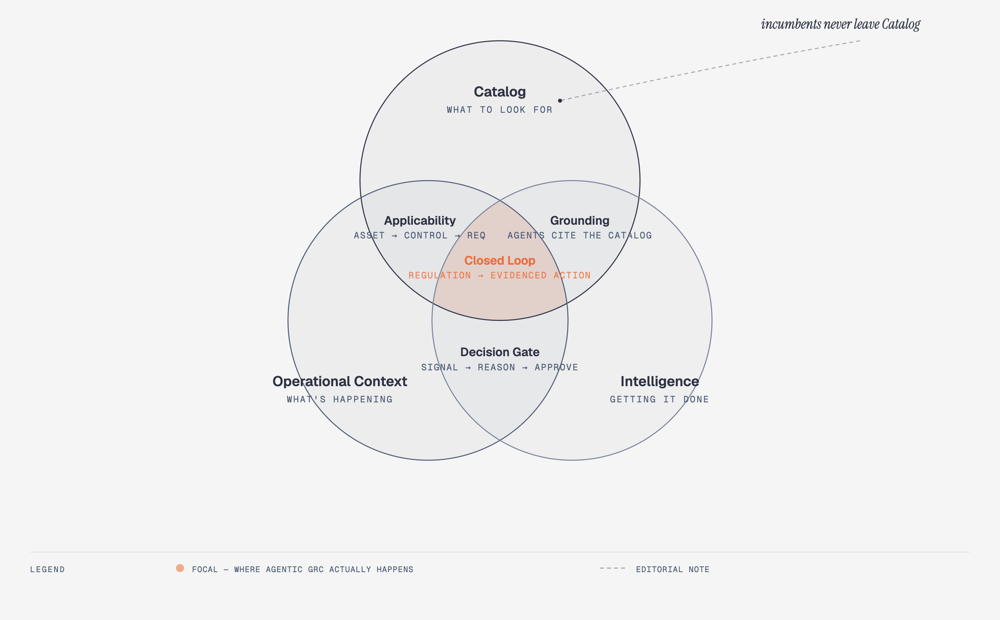

# Vyra Foundation — Requirements for a True Agentic GRC Platform

**Companion to `vyra-landscape.md` (vision/JTBD), `vyra-architecture.md` (software layers), `vyra-graph-spine.md` (schema), `vyra-implementation-plan.md` (sequencing).** This doc answers a narrower question than all four: *what must be technically true for a GRC system to earn the word "agentic," and does Vyra's design satisfy it?* It carries no build-status of its own — see `vyra-tracker.md` for that.

## The throughline

Every GRC product on the market today (ServiceNow GRC, OneTrust, LogicGate, Vanta, Drata, Archer) is a **document-and-workflow system of record**: policies live as text/PDF, obligation-to-control mapping is a human-maintained spreadsheet or form, "automation" means scheduled reminders and integration webhooks, and evidence is whatever a human uploads before an audit. None of them reason. None of them hold a live, queryable model of *what the enterprise actually is* connected to *what the law actually requires*, and none close the loop from a floor-level signal to a risk-scored, evidenced, human-approved action without a person manually walking every step.

**Agentic GRC** means the system itself — not a human copying data between tools — performs the Observe → Interpret → Reason → Act → Verify → Learn cycle over a live graph, with autonomy that is explicit, leveled, and auditable rather than all-or-nothing. That requires three structurally distinct concerns to coexist without collapsing into one undifferentiated database. Below is what each concern must guarantee, technically, to make that true — refined from the original Catalog / Operational Context / Intelligence framing and reconciled against Vyra's five-graph-domain design.

*Catalog, Operational Context, and Intelligence overlap at Applicability, Grounding, and the Decision Gate; the triple overlap (coral) is the Closed Loop that incumbent GRC tools never reach. [Interactive version](artifacts/foundation-venn.html).*

## The JTBD Principle — what autonomy is actually optimizing for

`vyra-landscape.md`'s 7-layer operating model names a persona and a Job To Be Done at every layer — Catalog Admin, Ops Admin, Planner, Ops Supervisor, Compliance Mgmt, Risk Manager. That JTBD framing isn't background context for a vision doc; it's the platform's actual optimization target. **The Intelligence layer exists to shrink each persona's JTBD, not to give them a better dashboard for doing it by hand indefinitely.**

A human belongs in the loop exactly where cognitive reasoning is required — a judgment call, a values tradeoff, an accountable sign-off that no amount of graph traversal resolves on its own. Everywhere else — scanning a regulation, mapping an obligation, scoring a routine risk, assembling evidence, drafting a recommendation — human involvement is a transitional cost the system is designed to retire, not a permanent feature of the workflow. As an agent family's reasoning and provenance mature for a given class of decision, that class moves off the human's desk and onto commodity, agent-executed rails.

This is what the Autonomy Levels (0–4, `vyra-landscape.md`) actually measure: not "how much AI touches this workflow" but *how much of the persona's JTBD has already moved to commodity execution, and how little of what remains still needs a human's cognition.* **Level 1 (Agent Recommends, Human Approves) is the default because it's where an unproven workflow starts, not because it's where a mature one is meant to stay** — the target state for any given workflow is the least human cognition its risk profile actually requires, not universal Level 1 forever.

## 1. Catalog — "what to look for" (Knowledge domain)

| Requirement | Technical shape |
|---|---|
| Regulations, standards, obligations, controls are **first-class graph nodes**, not documents | `Regulation → Clause → Requirement`, polymorphic `Clause` parent (`Regulation` \| `Standard`), reusable `Control` nodes independent of any one enterprise |
| **Global and enterprise-specific catalogs coexist without merging identity** | Structural dual-label (`:Catalog` vs `:Enterprise`) on the *same* node types — not a separate schema, not a property flag (a flag is invisible to pattern-matching and gets forgotten in queries/sync jobs) |
| **One master, many synced copies** — never a live cross-tenant query | One Neo4j graph per enterprise (no shared multi-tenant graph); a central versioned catalog store propagates down via a **periodic sync service**, chosen over live federation for query performance and blast-radius isolation |
| **Every catalog fact is versioned and non-destructively superseded** | `catalogVersion`, `effectiveFrom`, `supersededBy` per node — a repealed regulation is superseded, never deleted, so historical compliance state remains reconstructable |
| **Queryable on any axis** | Jurisdiction, authority, framework/standard, obligation type, control mechanism (preventive/detective/corrective), compliance area/domain taxonomy — each an independent traversal, not a hardcoded report |
| **Enterprise customization survives re-sync (monetization surface)** | Sync writes must be `MERGE ... ON MATCH SET n += row` (additive), so an enterprise can extend or annotate a catalog node with its own properties/links and not have them clobbered on the next central update — this is what makes the catalog tenant-monetizable (subscribe to the base library, extend it, don't fork it) |
| **Freshness is a measurable SLA, not a promise** | Every synced node/edge should be attributable to a sync run (timestamp, source revision) so "how current is our regulatory posture" is a query, not an assumption |

## 2. Operational Context — "what's happening" (Operational + Execution domains)

| Requirement | Technical shape |
|---|---|
| Enterprise structure is **graph, not free text** | `Organization → Role/Person → Facility → Asset`, `Vendor/Contract` — every entity a node with real relationships, so a compliance question can traverse from a regulation to the specific asset/role/site it binds to |
| **Applicability is an explicit, inspectable edge**, not implicit | `Asset -[:COVERED_BY]-> Control -[:IMPLEMENTS]-> Requirement` — a gap (an asset with no covering control) is a graph pattern, not a spreadsheet VLOOKUP |
| **Live operational signal, not a one-time snapshot** | Floor/system events write directly into the graph as they happen (`Signal` nodes, direct API writes) — not a periodic CSV re-import — so "current posture" reflects today, not the last ingestion |
| **The system can state its own posture at any instant** | Coverage scoring, uncovered-requirement counts, and risk rollups must be computable as live queries over current graph state, not precomputed reports that go stale |
| **Every mapping carries provenance** | Was this Asset↔Control link asserted by ingestion, by a human, or proposed by an agent? Confidence, source, and timestamp must be attributes of the edge or an adjacent node — never lost by treating the mapping as "just true" |
| **Documented absence is a first-class state** | An asset category with no matching control ("unmapped," e.g. Security) must be queryable as a known gap, distinct from "not yet checked" — silent nulls are not acceptable in a system used for audit |

## 3. Intelligence — "what needs to be done, and getting it done" (Intelligence + Assurance domains)

*This is where the JTBD Principle above becomes mechanism — autonomy levels and the Decision Gate are how "shrink the JTBD, keep humans only for judgment" actually gets built, not just stated.*

| Requirement | Technical shape |
|---|---|
| **A uniform agent lifecycle**, not point automations | Every agent — regulatory, applicability, control, signal, risk, assurance — runs the same loop: **Observe → Interpret → Reason → Act → Verify → Learn**. Different agent *families* own different sub-graphs; none call each other directly, none call the API — they coordinate only by reading/writing the shared graph |
| **Autonomy is leveled and explicit per workflow, never binary** | Levels 0–4 (Human Driven → Agent Recommends → Agent Assisted → Agent Executed → Fully Autonomous), default **Level 1** (agent proposes, human approves) unless a workflow is deliberately elevated. A "Decision" node with an approve/reject resolution path, attributable to a real person, is the structural gate — not a UI convention that can be bypassed |
| **Reasoning is tool-using and multi-step, not one prompt-in/JSON-out call** | An agent that assembles one fixed prompt and parses the reply once is not reasoning — it's templated. A true agent must decide *what to look at next* in the graph across multiple turns before acting (this is the highest-risk, least commoditized capability — most "AI GRC" claims stop short of it) |
| **Every autonomous action is traceable forward and reverse** | From a regulation to the tasks/controls it generated, and from any finding/decision back to the specific clause, signal, and reasoning step that produced it — traceability is a graph-traversal guarantee, not a report generated after the fact |
| **Evidence is generated, not collected** | `EvidencePackage / Attestation / AssuranceStatement / Audit` as graph nodes derived from the actual chain of Requirement→Control→Signal→Decision — audit-ready export is a query over real provenance, not a document someone assembled the week before the audit |
| **Risk and scenario reasoning require multiple agent families over shared state** | A residual risk score or "what if this control fails" simulation isn't one agent's job — it needs risk-intelligence and control-intelligence (and potentially signal-intelligence) reasoning over the *same* live graph simultaneously. This is the capability that most separates "workflow AI" from genuinely agentic GRC, and the one competitors don't attempt |
| **Learning closes the loop** | Human overrides of agent proposals (rejections, corrections) must feed back into future reasoning for that agent family — otherwise "Learn" in the lifecycle is aspirational, not real |

## Cross-cutting non-negotiables

- **The graph is the only integration bus.** UI → API only; API/agents/ingestion → one shared data-access module → graph. No component reaches another directly. This is what lets Catalog, Operational Context, and Intelligence stay separately owned but always consistent.
- **Isolation over sharing.** One graph per enterprise, not a shared multi-tenant store — a defensible security/compliance posture (customer data never traverses a boundary) is itself a market differentiator for a system whose product *is* trust.
- **Nothing is deleted, only superseded.** Regulations, decisions, and evidence are append-and-supersede, never overwritten — a compliance system that can't reconstruct its own history at any past date has not solved compliance.
- **Every gap is a documented graph state, not a silent omission.** "Unmapped," "unscoped," "pending sync" must be first-class, queryable states — an agentic system that can't say what it doesn't know isn't trustworthy enough to act autonomously.

## Why this doesn't exist today

Incumbent GRC platforms automate *workflow* (tickets, reminders, approvals) around a document store. None of them run a shared, live, multi-agent reasoning substrate over a structurally-versioned graph that spans regulation → enterprise structure → real-time signal → evidenced decision, with autonomy that is leveled rather than binary. That combination — not any single piece of it — is the product.
