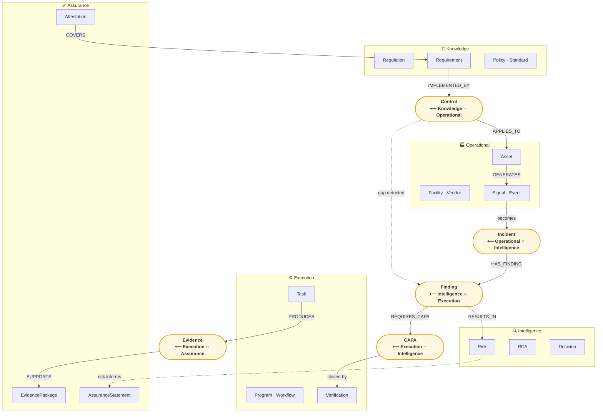
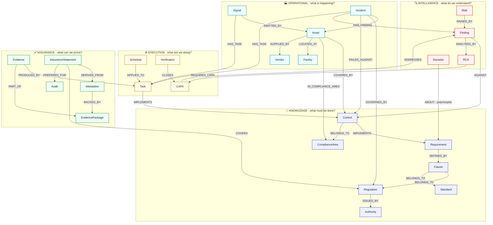
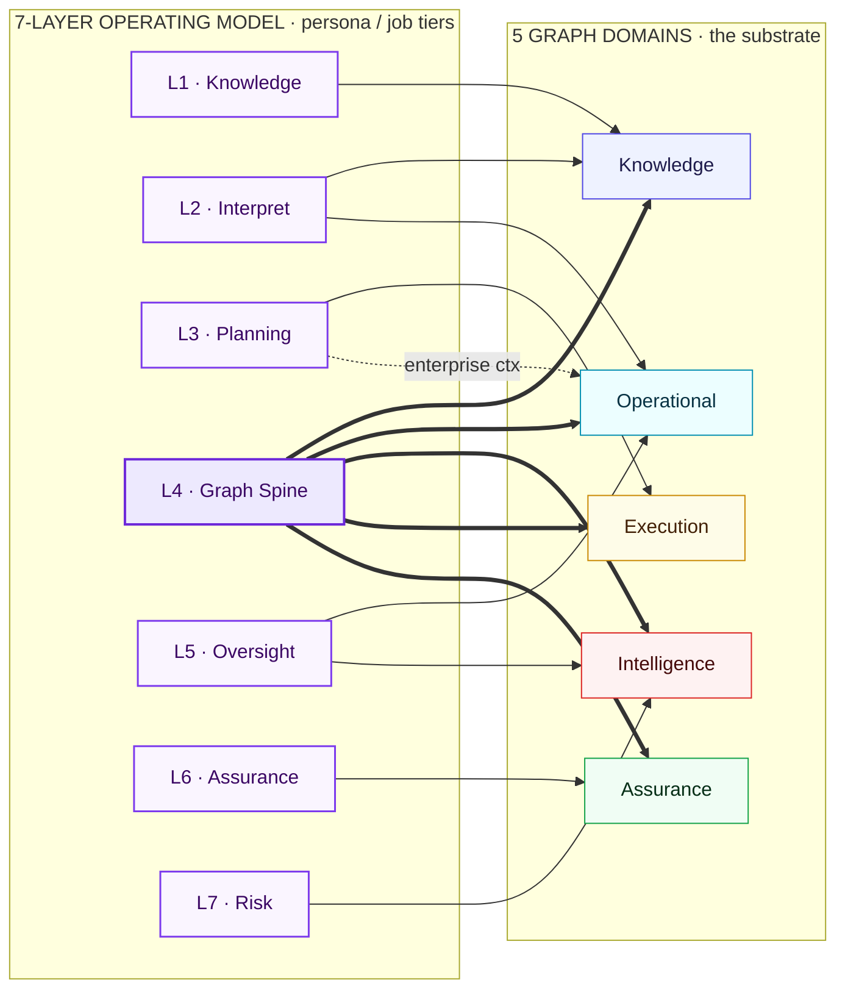
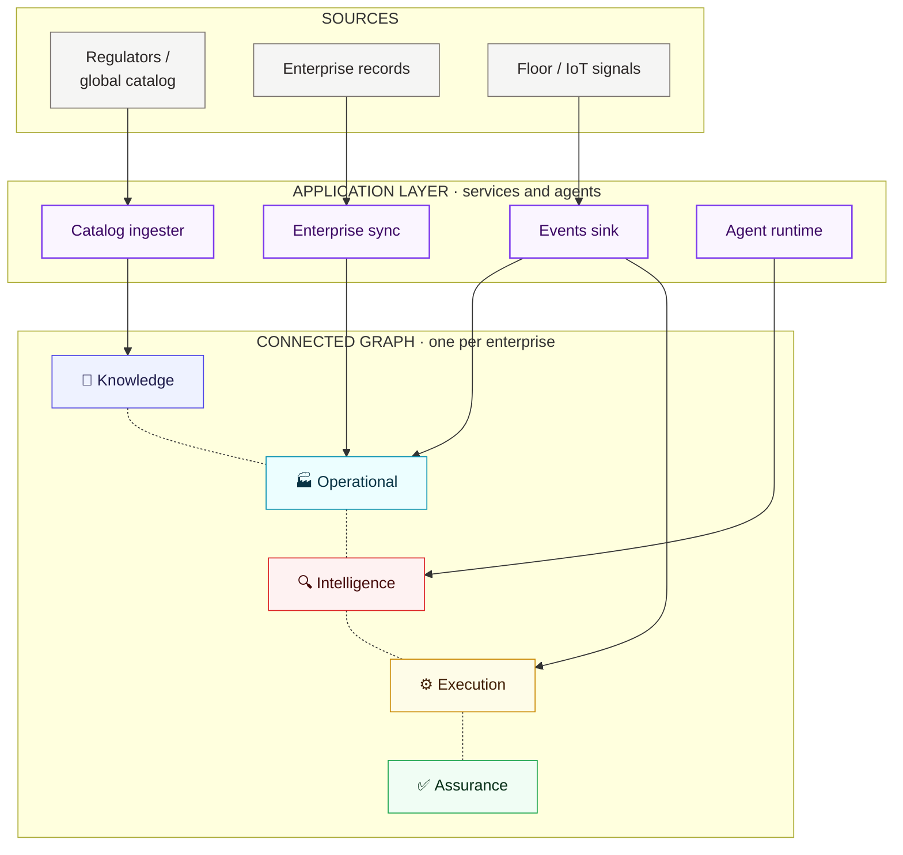
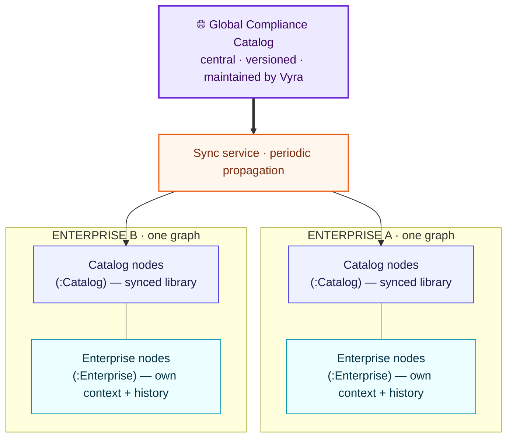
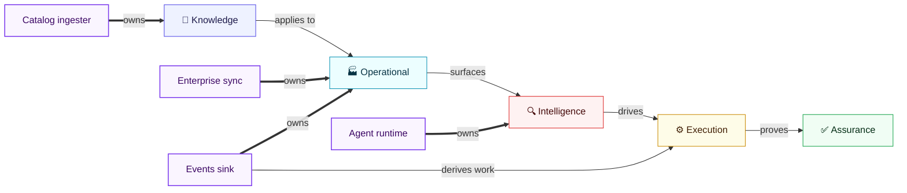
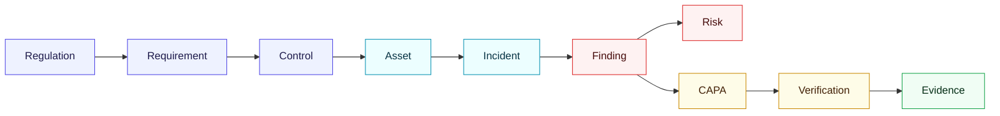

# Vyra Graph Spine

**The compliance digital twin — Vyra's canonical graph model.** This is the single source of truth for *what* Vyra stores, *how* the five compliance domains connect, and *how far* each part is actually built. Every schema, Cypher, and agent-design decision aligns to this document.

### Who should read this

- **Compliance & domain experts** — read **Part I–II**. In plain terms: what Vyra models, and how a regulation becomes provable assurance. You can stop after Part II.
- **Graph modelers / architects** — add **Part III** (where the data comes from, and what's live today vs. planned) for the full conceptual + provenance picture.
- **Graph / Node.js developers** — **Part IV** and the **Appendices** (node catalog, relationship catalog, feeds, constraints) are your working reference.

### How to read

| | | |
|---|---|---|
| **Part I** | Orientation | What Vyra models — the digital twin, the operating loop, the five domains. |
| **Part II** | The conceptual model | How the domains overlap and map to the operating model — in diagrams. |
| **Part III** | How the graph is populated | Data sources, reference-vs-enterprise data, and what's live vs. declared-but-not-yet-built. |
| **Part IV** | Working with the graph | Query and traversal patterns. |
| **Appendices A–F** | Reference | Every node, every relationship, feeds, constraints, lineage, and document history. |

> Optional companions: `vyra-landscape.md` gives the business-value / operating-model view; `vyra-architecture.md` shows the software layers and components built *around* this graph (how the API, agents, ingestion, and UI read and write it). This document stands on its own — you don't need either to understand the graph.

---

## Contents

- [Part I · Orientation — What Vyra Models](#part-i--orientation--what-vyra-models)
  - [1.1 The Compliance Digital Twin](#11-the-compliance-digital-twin)
  - [1.2 The Operating Loop](#12-the-operating-loop)
- [Part II · The Conceptual Model](#part-ii--the-conceptual-model)
  - [2.1 Domain Overlap & Bridge Nodes](#21-domain-overlap--bridge-nodes)
  - [2.2 The Layered Graph Model](#22-the-layered-graph-model)
  - [2.3 Mapping to the 7-Layer Operating Model](#23-mapping-to-the-7-layer-operating-model)
- [Part III · Data Flow & Ownership](#part-iii--data-flow--ownership)
  - [3.1 What Feeds the Twin](#31-what-feeds-the-twin)
  - [3.2 Global Catalog vs. Enterprise Catalog](#32-global-catalog-vs-enterprise-catalog)
  - [3.3 Ownership & Propagation](#33-ownership--propagation)
- [Part IV · Working with the Graph](#part-iv--working-with-the-graph)
- [Appendix A · Node Catalog](#appendix-a--node-catalog)
- [Appendix B · Relationship Catalog](#appendix-b--relationship-catalog)
- [Appendix C · CSV Feed Files](#appendix-c--csv-feed-files)
- [Appendix D · Neo4j Constraints & Indexes](#appendix-d--neo4j-constraints--indexes)
- [Appendix E · Data Lineage](#appendix-e--data-lineage)
- [Appendix F · Document History](#appendix-f--document-history)

---

# Part I · Orientation — What Vyra Models

## 1.1 The Compliance Digital Twin

Vyra models an organization's compliance posture as a **continuously evolving property graph** across five interconnected domains. Every compliance event — a regulation change, an incident, a failed control, an audit finding — is a node, and the relationships between them enable full **forward and reverse traceability**: from any regulation down to the evidence that proves it, and from any finding back to the regulation it implicates.

The five domains each answer one question:

| Domain | Question it answers | Anchor node |
|---|---|---|
| **Knowledge** | What must be done? | `Regulation` |
| **Operational** | What is happening? | `Incident` |
| **Intelligence** | What do we understand? | `Finding` |
| **Execution** | What are we doing? | `Task` |
| **Assurance** | What can we prove? | `Evidence` |

## 1.2 The Operating Loop

Read left to right, the domains form a single compliance loop. A regulation becomes an obligation; the obligation becomes a control; the control is exercised against a real asset; the asset throws a signal or an incident; the incident yields a finding; the finding drives risk scoring and a corrective action; and the closed-out action produces the evidence that proves compliance:

```
Regulation → Clause → Requirement → Control → Asset → Signal/Incident → Finding → Risk → CAPA → Verification → Assurance
```

This loop is the through-line for everything that follows: **Part II** draws it as diagrams, **Part III** shows which links are live today, and **Part IV** shows how to traverse it.

---

# Part II · The Conceptual Model

Three views of the same five domains: how they **overlap**, how they map to the **live schema**, and how they map to Vyra's **7-layer operating model**.

## 2.1 Domain Overlap & Bridge Nodes

Five domains. Nodes at domain boundaries belong to both neighbours — that is the overlap.



**Reading the diagram:**
- **Subgraphs** = the five graph domains — each owns its core entities.
- **Yellow nodes** = bridge entities that sit at the boundary of two domains.
- **Solid arrows** = the primary compliance loop (clockwise: Knowledge → Operational → Intelligence → Execution → Assurance → Knowledge). *These labels are conceptual — for the exact live relationship names, see the Layered Graph Model below or Appendix B.*
- **Dashed arrows** = cross-domain shortcuts (control gaps surface directly in Intelligence; risk posture feeds Assurance).

## 2.2 The Layered Graph Model

The same five domains as horizontal layers, read top-to-bottom along the operating loop (Knowledge → Operational → Intelligence → Execution → Assurance). Unlike the overlap diagram above — which sketches the conceptual clockwise loop — this view uses the **actual canonical relationship names and directions** from Appendix B (Relationship Catalog), so it doubles as a schema map. Dashed edges + grey nodes are part of the designed model but not yet carrying data.



**Reading the diagram:**
- **Five bands** = the five graph domains, stacked in operating-loop order.
- **Solid arrows** = relationships that are live today (all names/directions match Appendix B, including its runtime & derived relationships). The Assurance chain (`EvidencePackage`/`Attestation`/`AssuranceStatement`/`Audit`) is live as of Phase 4b but carries **synthetic, script-generated seed data**, not a real audit-trail source — see Appendix A.
- `Decision -->|ABOUT| Requirement` is drawn to `Requirement` as the representative target, but `ABOUT` is polymorphic (`Decision → *`, whatever `sourceId` resolves to).

## 2.3 Mapping to the 7-Layer Operating Model

The five graph domains and `vyra-landscape.md`'s 7-layer operating model are **orthogonal views, not a 1:1 mapping**. The 7 layers are persona/job tiers (who does the work); the 5 domains are the graph substrate itself. **Layer 4 (the Knowledge Graph Spine) *is* the whole graph — all five domains** — sitting at the center as every other layer's shared memory. The surrounding six layers each read/write a slice of it, and one domain can serve multiple layers (Intelligence backs both L5 and L7).



**Reading the diagram:**
- **Solid arrows** = the layer's primary read/write slice of the graph.
- **Thick arrows (L4)** = the Graph Spine spans *all five* domains — it is the graph, every other layer's shared memory.
- **Dashed arrow** = secondary reach (L3 Planning also pulls enterprise context — `Organization`/`Role`/`Facility` — from Operational).
- Note the many-to-many: L2 and L5 each touch two domains, and Operational + Intelligence are each read by multiple layers — this is why the mapping is *not* 1:1.

| JTBD Layer (`vyra-landscape.md`) | Graph domain(s) it reads/writes | Anchoring nodes / path |
|---|---|---|
| **L1 Knowledge** | Knowledge | `Regulation`/`Standard`/`Clause`/`Requirement`/`Control` |
| **L2 Interpret** | Knowledge ∩ Operational | applicability chain: `Asset -[:COVERED_BY]-> Control -[:IMPLEMENTS]-> Requirement` |
| **L3 Planning** | Execution (+ enterprise context) | `Schedule -[:APPLIES_TO]-> Task -[:IMPLEMENTS]-> Control`; `Organization`/`Role`/`Facility` |
| **L4 Graph Spine** | **all five** | the graph itself — this document; "Review" = the Autonomy Level 1 approval gate |
| **L5 Oversight** | Operational → Intelligence | `Signal`/`Incident` feeding `Finding` (`HAS_FINDING`) |
| **L6 Assurance** | Assurance | `Evidence`/`EvidencePackage`/`Attestation`/`AssuranceStatement`/`Audit` all live; the latter four are synthetic seed data (Phase 4b), not a real audit-trail source |
| **L7 Risk** | Intelligence | `Risk -[:RAISED_BY]-> Finding`, `RCA`, `Decision` |

---

# Part III · Data Flow & Ownership

The twin is not a static picture — it is continuously fed and kept current. This part explains, without implementation detail, **what** kinds of information flow into the graph, **how** the shared global catalog and each enterprise's own data coexist, and **who** owns each part and propagates change. For the concrete entities behind every idea here, see Appendix A.

## 3.1 What Feeds the Twin

Four kinds of information populate the digital twin, each carried in by its own service:

- **Compliance catalog** — the regulatory library: the authorities that issue rules, the regulations and standards they publish, the obligations those break down into, and the controls that satisfy them. A **catalog ingester** brings this in and refreshes it as regulation changes.
- **Enterprise context** — the organization itself: its business units and roles, its sites and facilities, and the equipment and assets that compliance attaches to. An **enterprise sync** service maps this in.
- **Incident history** — real audit and incident records that seed the operational and intelligence picture: what was inspected, what failed, what was found, and how it was resolved.
- **Live operational events** — signals arriving continuously from the floor. An **events sink** ingests each one and derives the follow-up work it implies.

The **application layer** (these services and agents) sits on top and writes into the **connected graph** underneath — one graph per enterprise:



**Reading the diagram:** top-to-bottom = sources → the services that ingest them → the sub-graph each writes into. The dotted line across the bottom is the **connected graph** itself — the sub-graphs are joined by relationships, which is what carries a change in one across to the others (§3.3).

*(For the exact entities and attributes behind each of these, see [Appendix A · Node Catalog](#appendix-a--node-catalog).)*

## 3.2 Global Catalog vs. Enterprise Catalog

Two catalogs coexist in every deployment:

- The **global compliance catalog** — centrally maintained by Vyra, identical for every customer: the authoritative, versioned library of regulations, standards, obligations, and reusable controls. When a regulator publishes a revision, the global catalog changes once, centrally.
- Each tenant's **enterprise catalog** — that organization's own context and history: its structure, sites, assets, incidents, and the compliance work it has performed.

Both live in the **same enterprise graph**, told apart structurally by a **label** — global-catalog entities carry `:Catalog`, enterprise entities carry `:Enterprise`. Because the distinction is a label rather than a hidden attribute, any question can scope cleanly to one or the other, and the *same kind of thing* — a regulation, a control — can exist in both a shared and an enterprise-specific form without clashing.

Keeping the two in step is the job of **intermediary sync services**: they propagate the central global catalog down into each enterprise graph on a cadence, so every tenant reasons against current regulation while its own enterprise data stays untouched. Vyra runs **one graph per enterprise**, not a shared multi-tenant graph — the global catalog is *synced into* each, never queried across a boundary.



**Reading the diagram:** one central catalog is maintained once and **synced down** into every enterprise's own graph, updating only the `:Catalog` side. Each tenant's `:Enterprise` data is never touched by the sync and never leaves its own graph — the two simply coexist, joined by relationships, inside one boundary per enterprise.

## 3.3 Ownership & Propagation

Each sub-graph has a clear owner — the service or agent responsible for authoring it — and a change made by one owner flows to the others *through the shared graph*, never by writing into another's territory:

- The **catalog ingester** owns the Knowledge sub-graph (regulations → obligations → controls). When a regulation is revised, the change lands here, and everything downstream now reads against the new version.
- The **enterprise sync** owns enterprise context (organization, roles, facilities, assets) and the links that place each asset under the controls that apply to it.
- The **events sink** owns the live operational sub-graph. When a signal arrives against an asset, it resolves which controls and obligations already cover that asset and derives the follow-up task automatically — the operating loop advancing on its own, one hop at a time.
- **Agents** own their own contributions: they reason over the graph and record a recommendation as a first-class node, under human-approval autonomy — proposing, never silently rewriting what another owner authored.



**Reading the diagram:** the **thick "owns" arrows** show who authors each sub-graph; the **thin arrows** are how a change propagates *through the shared graph* — no owner writes into another's territory.

The through-line: a regulation change, an incident, a signal, an agent's recommendation each land in their **own** sub-graph, and the **relationships between sub-graphs** carry the consequence forward. That is exactly what makes the twin traceable end to end — and what Part IV shows you how to walk.

---

# Part IV · Working with the Graph

Every compliance question is a **walk along the traceability chain** — the operating loop from §1.2, followed in one direction or the other. Read left to right, you go **forward**: from a regulation, down to the evidence that proves it. Read right to left, you go **reverse**: from a finding or a piece of evidence, back to the obligation and regulation it answers to.



- **Forward** (`Regulation → … → Evidence`): *"What do we do about this rule, and can we prove it?"*
- **Reverse** (`Finding → … → Regulation`): *"Which obligation does this failure implicate?"*
- **Sideways**: the same chain answers posture questions — asset risk, vendor exposure, CAPA closure rate — by pivoting at any node.

Every named query below is one of these walks. The rest of this part is a **developer reference**: the exact Cypher the API is built on.

## Sample Queries (developer reference)

### Forward Traceability — Regulation to Evidence
*"Show me everything under OSHA"*
```cypher
MATCH (reg:Regulation {id: 'REG-OSHA'})
      <-[:GOVERNED_BY]-(inc:Incident)
      -[:INVOLVES]->(ast:Asset)
MATCH (inc)-[:OCCURRED_AT]->(fac:Facility)
OPTIONAL MATCH (inc)-[:HAS_FINDING]->(fnd:Finding)
OPTIONAL MATCH (fnd)-[:ANALYSED_BY]->(rca:RCA)
OPTIONAL MATCH (rca)-[:REQUIRES_CAPA]->(capa:CAPA)
RETURN reg, inc, ast, fac, collect(fnd) AS findings, collect(rca) AS rcas, collect(capa) AS capas
```

### Reverse Traceability — Finding to Regulation
*"Which regulations are implicated by this finding?"*
```cypher
MATCH (fnd:Finding {id: 'FND-001-01'})
      <-[:HAS_FINDING]-(inc:Incident)
      -[:GOVERNED_BY]->(reg:Regulation)
RETURN fnd, inc, collect(reg) AS regulations
```

### Incident Impact Analysis — Asset Risk Propagation
*"Which assets carry the highest residual risk?"*
```cypher
MATCH (inc:Incident)-[:INVOLVES]->(ast:Asset)
MATCH (inc)-[:OCCURRED_AT]->(fac:Facility)
RETURN ast.id, ast.name, fac.id, max(toInteger(inc.residualRisk)) AS maxRisk, inc.riskRating
ORDER BY maxRisk DESC
```

### Vendor Risk Exposure
*"Which vendors are linked to critical incidents?"*
```cypher
MATCH (inc:Incident {riskRating: 'Critical'})-[:MANAGED_BY]->(vnd:Vendor)
MATCH (inc)-[:INVOLVES]->(ast:Asset)
RETURN vnd.id, vnd.name, count(inc) AS incidentCount, collect(ast.name) AS assets
ORDER BY incidentCount DESC
```

### Compliance Posture — CAPA Closure Rate
*"What is the end-to-end CAPA resolution rate?"*
```cypher
MATCH (fnd:Finding)-[:ANALYSED_BY]->(rca:RCA)-[:REQUIRES_CAPA]->(capa:CAPA)
OPTIONAL MATCH (capa)<-[:CLOSES]-(ver:Verification)
RETURN
    count(DISTINCT capa) AS totalCAPAs,
    count(DISTINCT ver) AS verifiedCAPAs,
    round(100.0 * count(DISTINCT ver) / count(DISTINCT capa)) AS closureRatePercent
```

### Compliance Coverage — Which Controls Cover This Asset
*"What Controls and Requirements apply to this Asset?"*
```cypher
MATCH (a:Asset {id: 'AST-001'})-[:COVERED_BY]->(ctl:Control)-[:IMPLEMENTS]->(req:Requirement)
RETURN a.name, a.category, collect(DISTINCT ctl.name) AS controls, collect(DISTINCT req.name) AS requirements
```

### Continuous Monitoring — Regulation Coverage
*"Which regulations are covered by continuous monitoring?"*
```cypher
MATCH (reg:Regulation)<-[:GOVERNED_BY]-(inc:Incident)
WHERE inc.continuousMonitoring IS NOT NULL AND inc.continuousMonitoring <> ''
RETURN reg.name, collect(DISTINCT inc.continuousMonitoring) AS monitoringCapabilities
```

---

# Appendix A · Node Catalog

Complete property-level reference for every node type, grouped by domain. *Parenthetical build-phase tags (e.g. "Phase 3") are provenance markers tied to the history in Appendix F; they carry no meaning for reading the schema itself.*

## Knowledge Graph

### `Regulation`
Regulatory frameworks and standards that apply to the organization.

| Property | Type | Example |
|---|---|---|
| id | string | `REG-OSHA`, `REG-ISO_45001` |
| name | string | `OSHA`, `EU GMP Annex 1` |
| version | string | `1.0` |
| status | string | `active` |

**Seed data (16 regulations, enterprise pipeline, unlabeled):**  
OSHA, NBC India, ISO 45001, US FDA GMP, EU GMP Annex 1, ISO 13485, FSMA, HACCP, FSSAI Schedule 4, USP, FDA Water Systems Guidance, ISO 22000, ISO 17025, FSSAI Packaging Rules, IEC 62443, NIST CSF

**Plus 11 catalog regulations (`:Catalog` label, `cli/orchestration/catalog-sync.ts`)** — Industrial Parks/Warehouse/3PL vertical, India + UK. New props: `authorityId`, `catalogVersion`, `effectiveFrom`, `supersededBy` (self-referential — a repealed regulation is superseded, never deleted).

---

### `Authority`
Regulatory body that issues or enforces a `Regulation` (Knowledge, `:Catalog`).

| Property | Type | Example |
|---|---|---|
| id | string | `AUTH-001` |
| name | string | `Bureau of Indian Standards` |
| abbreviation | string | `BIS` |
| authorityType | string | `National Standards Body` |
| jurisdictionId | string | `JUR-INDIA` |

**8 authorities**, seeded from `.design/__ref/synthetic-data/data.csv`'s `02_Regulatory_Authorities` worksheet.

---

### `Standard`
Industry/international standard (Knowledge, `:Catalog`) — a `Clause`'s source document, alongside `Regulation`.

**10 standards** (ISO 45001, ISO 14001, NFPA 25, BS 9999, …), seeded from `04_Standards`. Props unchanged from the original `v2.ts` shape (`body`, `referenceDoc`, `version`).

---

### `Clause` / `Requirement`
`Clause` (Knowledge, `:Catalog`) belongs to exactly one of `Regulation` or `Standard` (`regulationId` XOR `standardId` populated per row — never both, per `05_Clauses`' `Source Type`/`Source ID` columns). `Requirement` (Knowledge, `:Catalog`) is `06_Obligations` mapped 1:1 — `ObligationID → id`, `Mandatory (Y/N) → mandatory` — reusing the existing `Requirement` type rather than adding a second node type for the same concept.

**34 clauses, 34 requirements.**

---

### `Control`
Policies, SOPs, and operational procedures that implement requirements.

| Property | Type | Example |
|---|---|---|
| id | string | `CTL-001-01`, `CTRL-004` |
| name | string | `Fire Safety SOP`, `Fire Hydrant System Pressure Test` |
| controlType | string | `policy-sop` (legacy), `Preventive`/`Detective` (`:Catalog` rows) |
| owner | string | `Facility & EHS` (legacy rows only) |
| requirementId | string | `REQ-XXX` (legacy) / `OBL-0004` (`:Catalog`) — FK to Requirement |
| complianceAreaId | string | `CA-002` (`:Catalog` rows only) — FK to ComplianceArea |
| riskId | string | `RSK-013` (`:Catalog` rows only, flat reference — no dedicated rel; the catalog `17_Risk_Register` taxonomy this points at is not yet ingested) |
| clauseId / standardId / regulationId / authorityId | string | (`:Catalog` rows only, flat reference — already reachable via `Requirement -> Clause -> Regulation/Standard`, no duplicate rel added) |
| status | string | `active` |

**15 controls** (legacy enterprise pipeline, unlabeled, per-incident numbering `CTL-{incident}-{seq}`, from the "Policies & SOPs" column) **+ 30 controls** (`CTRL-001`–`CTRL-030`, `:Catalog` label, from `08_Operational_Controls` — a reusable control catalog, not per-incident) — same dual-origin coexistence pattern as `Regulation`/`Regulation:Catalog`.

---

### `ComplianceArea`
Compliance domain taxonomy (Knowledge, `:Catalog`) — the shared vocabulary that links `Control` and `Asset` (see `IN_COMPLIANCE_AREA`/`BELONGS_TO`/`COVERED_BY` in Appendix B).

| Property | Type | Example |
|---|---|---|
| id | string | `CA-002` |
| name | string | `Fire Suppression Systems` |
| description | string | `Hydrants, sprinklers/ESFR, fire pump houses, and portable fire extinguishers.` |

**10 compliance areas**, 1:1 from `07_Compliance_Areas`.

---

## Execution Graph

### `Task`
Compliance activities that must be performed to maintain or restore compliance.

| Property | Type | Example |
|---|---|---|
| id | string | `TSK-001-01`, `TSK-SIG-TEST-001` (signal-driven) |
| name | string | `Inspect detector` |
| owner | string | `Priya Nair - QA Executive` (legacy) / `'UNKNOWN'` (signal-driven, until `Person` is seeded) |
| frequency | string | `incident-driven`, `signal-driven` |
| priority | string | `Critical` |
| dueDate | datetime | `2026-05-03 17:36` |
| workflowId | string | FK to Workflow |
| evidenceRequired | string | `yes` |
| controlIds / requirementIds | string[] | native array props, signal-driven Tasks only — every `Control`/`Requirement` the triggering `Asset` is covered by (via `COVERED_BY`), not a single FK, since one Asset can match multiple Controls under one ComplianceArea |
| controlId | string | `CTRL-001` (`:Catalog` rows only) — FK to Control, singular (one Task template implements exactly one Control, per `09_Task_Master`'s `Control ID` column) |
| status | string | `closed` / `open` |

**Signal-driven Tasks** are created live by the events sink when a signal arrives, not by the batch ingest — see §3.3.

**24 tasks** (legacy enterprise pipeline, unlabeled, across 7 incidents) **+ 60 tasks** (`TSK-0001`–`TSK-0060`, `:Catalog` label, from `09_Task_Master` — kept thin per `entity-alignment.md`'s warning not to ingest that 39-column rollup as-is) — same dual-origin coexistence pattern as `Regulation`/`Control`. Plus signal-driven `TSK-SIG-*` rows, unlabeled, created ad hoc.

---

### `CAPA`
Corrective and preventive actions triggered by findings.

| Property | Type | Example |
|---|---|---|
| id | string | `CAPA-001-01` |
| name | string | `Renew AMC` |
| owner | string | (person) |
| dueDate | datetime | |
| findingId | string | FK to Finding |
| status | string | `closed` |

**20 CAPAs** across 7 incidents.

---

### `Verification`
Confirmation that a CAPA was executed and effective.

| Property | Type | Example |
|---|---|---|
| id | string | `VER-001-01` |
| name | string | `Detector tested successfully` |
| outcome | string | (description) |
| verifiedAt | datetime | |
| verifiedBy | string | (person) |
| capaId | string | FK to CAPA |
| status | string | `closed` |

**13 verifications** across 7 incidents.

---

### `Schedule`
Cadence for a `Task` (`Schedule -[:APPLIES_TO]-> Task`, `:Catalog`) — corrected from the originally-declared `Schedule -> Requirement`, which was one hop too coarse: `13_Schedule_Rules` is keyed by `TaskID`, and `Task` (via its new `controlId`) already reaches `Requirement` through `Control`, so `Schedule -> Task -> Control -> Requirement` is the real, non-fabricated chain.

| Property | Type | Example |
|---|---|---|
| id | string | `SCH-TSK-0001` (synthesized, 1:1 with Task) |
| name | string | `Schedule - TSK-0001` |
| cadenceUnit | string | `hour` / `day` / `week` / `month` |
| cadenceInterval | string | `3` (e.g. Quarterly = month/3) |
| anchorDate | string | `2026-01-01` |
| taskId | string | FK to Task |

**50 schedules** (`SCH-TSK-0001`–..., `:Catalog` label), from the 50 of 60 `13_Schedule_Rules` rows where `Schedule Type = Fixed`. The other 10 (`Condition Based`/`Event Based`/`Sensor Triggered`/`Risk Triggered`/`AI Triggered`) are event-driven, not periodic — they get a `Task` but no `Schedule`, and are correctly served by the Signal→Task path (§3.3) instead.

`Frequency` (`13_Schedule_Rules`, qualitative) maps to `cadenceUnit`/`cadenceInterval` via a fixed lookup table in `cli/scripts/convert-catalog-seed.ts` (`Hourly`→hour/1, `Daily`→day/1, `Weekly`→week/1, `Fortnightly`→week/2, `Monthly`→month/1, `Quarterly`→month/3, `Half-Yearly`→month/6, `Annual`→month/12) — a direct translation of the label, not fabricated data. `anchorDate` resolves `"Week NN"` as `2026-01-01 + 7×(NN−1)` days (naive 7-day blocks, not ISO week numbering). `api/modules/catalog/repo.ts`'s `computeWindow({cadenceUnit, cadenceInterval, anchorDate}, horizonWeeks)` expands a cadence into occurrence dates (deduped — sub-day cadences like `hour` step faster than this function's day-level granularity) and backs `GET /catalog/calendar`, joined with `Task`/`Control` for the UI's 52-week calendar (`ui/src/features/calendar/calendar.tsx`).

---

## Operational Graph

### `Incident`
The central operational node. Represents an audit-triggered compliance incident, capturing the full context: what happened, where, which asset, which vendor, who responded.

| Property | Type | Example |
|---|---|---|
| id | string | `INC-001` |
| name | string | `Quarterly EHS Audit` |
| auditType | string | `Quarterly EHS Audit` |
| scheduleType | string | `Planned` / `Adhoc` |
| planningTime | datetime | `2026-05-03 12:00` |
| auditTime | datetime | `2026-05-03 17:00` |
| incidentTime | datetime | `2026-05-03 17:36` |
| scope | string | `Warehouse Zone B | Fire Safety | Insurance Compliance` |
| businessUnit | string | `Facility & EHS` |
| escalationPath | string | `Facility Engineer → EHS Head → ...` |
| capturedBy | string | `Priya Nair - QA Executive` |
| reviewedBy | string | `Karthik Iyer - Corporate EHS` |
| closure | string | `Closed after verification` |
| dashboardMetrics | string | `Fire Safety Compliance Score | Vendor Risk Score` |
| continuousMonitoring | string | `AI AMC expiry prediction | Fire sensor anomaly detection` |
| likelihood | int | `4` |
| severity | int | `5` |
| residualRisk | int | `18` |
| riskRating | string | `Critical` |
| facilityId | string | `FAC-1002` |
| assetId | string | `FSD-BLR-WH-B-447` |
| vendorId | string | `VND-2002` |
| status | string | `closed` |

**7 incidents** in seed data.

---

### `Facility`
The compliance-bearing physical unit — the thing that gets inspected, audited, and licensed. Chosen over a separate `Location` node type (design decision): finer-grained physical position (site/building/zone/room) is modeled as attributes on `Facility`/`Asset`, not as additional node types — geography alone has no regulatory standing, `Facility` does.

| Property | Type | Example |
|---|---|---|
| id | string | `FAC-1002`, `LOC-001` |
| name | string | `FAC-1002`, `Bengaluru Industrial & Logistics Park` |
| businessUnit | string | `Facility & EHS` (enterprise-pipeline rows only) |
| region | string | |
| company | string | `Vantage Industrial Parks & Logistics REIT` (`:Enterprise` rows only) |
| status | string | `active` |

**7 facilities** (`FAC-1002`–`FAC-1008`, enterprise pipeline, unlabeled) **+ 20 facilities** (`LOC-001`–`LOC-020`, `:Enterprise` label, deduped to Site granularity from `11_Spatial_Mapping`'s 100 rows by `cli/scripts/convert-enterprise-seed.ts`).

---

### `Asset`
Equipment, systems, or infrastructure involved in the incident.

| Property | Type | Example |
|---|---|---|
| id | string | `FSD-BLR-WH-B-447`, `AST-001` |
| name | string | `Honeywell NOTIFIER Smoke Detector` |
| assetType | string | `equipment` |
| owner | string | `Facility & EHS` (enterprise-pipeline rows only) |
| facilityId | string | `FAC-1002`, `LOC-001` — FK to Facility |
| vendorId | string | `VND-2002` (enterprise-pipeline rows only) |
| buildingId | string | `BLD-002` (`:Enterprise` rows only) |
| zoneId | string | `ZN-004` (`:Enterprise` rows only) |
| roomId | string | `RM-004` (`:Enterprise` rows only) |
| category | string | `Fire Suppression` (`:Enterprise` rows only) |
| complianceAreaId | string | `CA-002` (`:Enterprise` rows only) — FK to ComplianceArea, mapped from `category` via a manual, name/description-backed table in `convert-enterprise-seed.ts`. `Security`-category assets (2 of 31) have no mapping — no ComplianceArea in the source data corresponds to it; left blank on purpose, not guessed. |
| status | string | `active` |

**7 assets** (enterprise pipeline, unlabeled):
| ID | Name | Facility |
|---|---|---|
| FSD-BLR-WH-B-447 | Honeywell NOTIFIER Smoke Detector | FAC-1002 |
| BIO-RCT-2209 | Sartorius Biostat STR 2000L | FAC-1003 |
| CIP-MOGA-884 | GEA CIP Cleaning System | FAC-1004 |
| RO-HYD-1102 | Veolia RO Water Treatment System | FAC-1005 |
| DRN-PKG-221 | Drainage System - Packaging Hall | FAC-1006 |
| WT-ANAND-778 | Mettler Toledo ICS685 Scale | FAC-1007 |
| IOT-CHN-992 | Cisco Industrial IoT Gateway | FAC-1008 |

**Plus 31 assets** (`AST-001`–`AST-031`, `:Enterprise` label, from `19_Asset_Equipment_Master`) — a second, non-colliding ID space, each carrying a real `LOCATED_AT` edge to its `:Enterprise`-labeled `Facility`.

**Note:** `facilityId` existed in the enterprise pipeline's `assets.csv` since the original seed but was never wired to a relationship — `LOCATED_AT` was undeclared in `v2.ts` until Enterprise Context added it, so the 7 original assets also emit `LOCATED_AT` edges to their (unlabeled) `Facility` on every `./ingest.sh` run, no new data required.

---

### `Organization`
Enterprise org unit (`:Enterprise`) — a Company/BusinessUnit/Department combination that a `Role` belongs to.

| Property | Type | Example |
|---|---|---|
| id | string | `ORG-VANTAGE_INDUSTRIAL_PARKS_LOGISTICS_REIT__EHS__SAFETY` |
| name | string | `EHS - Safety` |
| company | string | `Vantage Industrial Parks & Logistics REIT` |

**12 organizations**, deduped by Company/BusinessUnit/Department from `10_Organization_Mapping`'s 16 rows.

---

### `Role`
A job function within an `Organization` (`:Enterprise`).

| Property | Type | Example |
|---|---|---|
| id | string | `ROLE-004` |
| name | string | `EHS Manager (Regional)` |
| businessUnit | string | `EHS` |
| department | string | `Safety` |
| approvalAuthority | string | `Y` / `N` |
| organizationId | string | FK to Organization |

**16 roles**, 1:1 from `18_Roles_Master`.

---

### `Person` — declared, not fed
Named individual holding a `Role` and working at a `Facility` (`:Enterprise`). Props: `email`, `roleId`, `facilityId`. The model provides for it (`HAS_ROLE → Role`, `WORKS_AT → Facility`), awaiting an identity source; until then `Incident.capturedBy`/`reviewedBy`/`Task.owner` stay free-text strings.

---

### `Vendor`
Third-party suppliers of assets or services involved in incidents.

| Property | Type | Example |
|---|---|---|
| id | string | `VND-2002` |
| name | string | `VND-2002` |
| contactName | string | `Priya Nair - QA Executive` |
| riskTier | string | `medium` |
| status | string | `active` |

**7 vendors:** VND-2002 through VND-2008.

---

### `Signal`
A live operational event against an `Asset` — the first node type written entirely outside the CLI pipeline.

| Property | Type | Example |
|---|---|---|
| id | string | `SIG-TEST-001` (caller-supplied) |
| name | string | defaults to `id` if not supplied |
| type | string | `fire-alarm-trip` |
| source | string | `'UNKNOWN'` if not supplied |
| timestamp | string | ISO string, defaults to write-time |
| payload | string | free text, defaults to `''` |
| assetId | string | FK to Asset |
| status | string | `new` |

No CSV feed — written live by the events sink when a signal arrives. See §3.3.

---

## Intelligence Graph

### `Finding`
Specific compliance gaps or failures identified during an audit.

| Property | Type | Example |
|---|---|---|
| id | string | `FND-001-01` |
| name | string | `Critical fire detector offline` |
| severity | string | `Critical` |
| detectedAt | datetime | `2026-05-03 17:36` |
| controlId | string | FK to Control |
| incidentId | string | FK to Incident |
| status | string | `closed` |

**15 findings** across 7 incidents.

---

### `Risk`
Risk assessment derived from findings, with inherent and residual scores.

| Property | Type | Example |
|---|---|---|
| id | string | `RSK-001` |
| name | string | `Risk - Quarterly EHS Audit` |
| inherentRating | string | `Critical` |
| inherentScore | int | `18` |
| inherentLikelihood | int | `4` |
| inherentConsequence | int | `5` |
| residualRating | string | `Critical` |
| residualScore | int | `18` |
| findingId | string | FK to Finding |
| owner | string | (person) |
| status | string | `closed` |

**Risk score distribution across 7 incidents:**
| Incident | Likelihood | Severity | Residual Risk | Rating |
|---|---|---|---|---|
| INC-001 (Fire Detector) | 4 | 5 | 18 | Critical |
| INC-002 (Bioreactor) | 5 | 5 | 20 | Critical |
| INC-003 (CIP System) | 4 | 4 | 14 | High |
| INC-004 (RO Water) | 3 | 5 | 15 | High |
| INC-005 (Drainage) | 3 | 4 | 11 | Medium |
| INC-006 (Scale Calibration) | 4 | 3 | 10 | Medium |
| INC-007 (IoT Network) | 5 | 4 | 17 | High |

---

### `RCA`
Root cause analysis entries linked to findings.

| Property | Type | Example |
|---|---|---|
| id | string | `RCA-001-01` |
| name | string | `AMC renewal missed` |
| rootCause | string | (description) |
| analysedAt | datetime | |
| findingId | string | FK to Finding |
| status | string | `completed` |

**15 RCAs** across 7 incidents.

---

### `Decision`
An agent's recommendation (first real agent). Autonomy Level 1 — proposes only, never mutates the graph beyond writing this node.

| Property | Type | Example |
|---|---|---|
| id | string | `DEC-OBL-0012` |
| type | string | `control-recommendation` |
| rationale | string | the LLM's one/two-sentence recommendation |
| agentId | string | `control-intelligence-agent` |
| autonomyLevel | int | `1` |
| confidence | float | `0`–`1`, LLM-reported |
| status | string | `pending` |
| decidedAt | datetime | |

No CSV feed — recorded live by the agent runtime when an agent reasons. See §3.3.

---

## Assurance Graph

### `Evidence`
Artifacts collected during the incident/audit that prove compliance activities.

| Property | Type | Example |
|---|---|---|
| id | string | `EVD-001-01` |
| name | string | `Audit report` |
| type | string | `audit-artifact` |
| source | string | `INC-001` |
| collectedAt | datetime | |
| taskId | string | FK to Task |
| status | string | `collected` |

**30 evidence items** across 7 incidents. Each carries a `packageId` FK (Phase 4b) into its `EvidencePackage`.

---

### `EvidencePackage`
A bundle of `Evidence` assembled for a single Incident's audit period — the unit an `Attestation` signs off on. **Synthetic, Phase 4b (2026-08-16):** script-generated 1:1 per Incident (`cli/scripts/generate-assurance-seed.ts`), not sourced from a real audit-management system — a placeholder shape for when one exists.

| Property | Type | Example |
|---|---|---|
| id | string | `EPKG-INC-001` |
| name | string | `Evidence Package - Quarterly EHS Audit` |
| period | string | `2026-Q2` — derived from `Incident.incidentTime` |
| status | string | `assembled` |

**7 evidence packages**, one per Incident.

---

### `Attestation`
A named individual's formal sign-off that an `EvidencePackage` is complete and accurate. **Synthetic, Phase 4b:** `attestedBy` reuses the real `Incident.reviewedBy` value already on the incident record (not invented); `attestedAt` = `Incident.incidentTime` + 3 days.

| Property | Type | Example |
|---|---|---|
| id | string | `ATT-INC-001` |
| name | string | `Attestation - Quarterly EHS Audit` |
| attestedBy | string | `Karthik Iyer - Corporate EHS` |
| attestedAt | datetime | |
| packageId | string | FK to EvidencePackage |
| status | string | `attested` |

**7 attestations**, one per EvidencePackage.

---

### `AssuranceStatement`
The auditor-facing posture statement derived from an `Attestation` — what Audit-Ready Export actually exports. **Synthetic, Phase 4b:** `scope` reuses `Incident.scope`; `posture` is **computed, not asserted** — walked live from the real CAPA-closure chain (`Incident -[:HAS_FINDING]-> Finding -[:ANALYSED_BY]-> RCA -[:REQUIRES_CAPA]-> CAPA -[:CLOSES]<- Verification`): `"Compliant"` only if every CAPA reachable from the incident has a Verification, else `"Compliant with open corrective action"`. All 7 incidents resolve to the latter — each has 2–4 CAPAs but only 1 Verification apiece in the underlying seed data, a real (if coincidental) gap the computation surfaces rather than hides.

| Property | Type | Example |
|---|---|---|
| id | string | `ASM-INC-001` |
| name | string | `Assurance Statement - Quarterly EHS Audit` |
| scope | string | `Warehouse Zone B \| Fire Safety \| Insurance Compliance` |
| posture | string | `Compliant with open corrective action` |
| generatedAt | datetime | |
| attestationId | string | FK to Attestation |
| status | string | `issued` |

**7 assurance statements**, one per Attestation.

---

### `Audit`
The formal audit engagement an `AssuranceStatement` is prepared for. **Synthetic, Phase 4b:** promoted 1:1 from the audit metadata already sitting unused on `Incident` (`auditType`, `incidentTime`, `reviewedBy`) — `Incident` itself models "an audit-triggered compliance incident," so `Audit` is that same engagement made a first-class node rather than a free-text field.

| Property | Type | Example |
|---|---|---|
| id | string | `AUD-INC-001` |
| name | string | `Quarterly EHS Audit` |
| type | string | `Incident.auditType` |
| period | string | `2026-Q2` |
| auditor | string | `Incident.reviewedBy` |
| status | string | `closed` |

**7 audits**, one per Incident.

---

# Appendix B · Relationship Catalog

All relationships below are **live** and are the relationships the API actually queries. The first group is written by the batch ingest; the **Runtime & derived relationships** group at the end is authored at runtime or by a derived join (see §3.3 for who owns them).

### Knowledge Graph
| Relationship | From → To | Meaning |
|---|---|---|
| `GOVERNED_BY` | Incident → Regulation | Incident is subject to this regulation |
| `IMPLEMENTS` | Control → Requirement | Control satisfies a requirement |
| `FAILED_AGAINST` | Incident → Control | Control failed during this incident |
| `IN_JURISDICTION` | Regulation → Jurisdiction | Regulation applies within this jurisdiction |
| `ISSUED_BY` | Regulation → Authority | Regulation is issued/enforced by this authority |
| `OPERATES_IN` | Authority → Jurisdiction | Authority's jurisdiction of operation |
| `BELONGS_TO` | Clause → Regulation **or** Clause → Standard | Clause's source document (polymorphic — a clause has exactly one parent, never both) |
| `DEFINED_BY` | Requirement → Clause | Requirement is defined by this clause |
| `BELONGS_TO` | Control → ComplianceArea | Control's compliance domain (`:Catalog` rows only — same name-reuse safety as Clause→Regulation/Standard above) |

### Execution Graph
| Relationship | From → To | Meaning |
|---|---|---|
| `HAS_TASK` | Incident → Task | Task assigned in response to incident |
| `REQUIRES_CAPA` | RCA → CAPA | Root cause analysis prescribes a corrective action |
| `ADDRESSES` | CAPA → Finding | Corrective action addresses the finding |
| `CLOSES` | Verification → CAPA | Verification closes the CAPA |
| `IMPLEMENTS` | Task → Control | Task is the recurring instance of what the Control requires (`:Catalog` rows only — reuses `IMPLEMENTS`, same as `Control -> Requirement`) |
| `APPLIES_TO` | Schedule → Task | Schedule's cadence applies to this Task (`:Catalog` rows only, 50 of 60 Tasks) |

### Operational Graph
| Relationship | From → To | Meaning |
|---|---|---|
| `OCCURRED_AT` | Incident → Facility | Physical location of the incident |
| `INVOLVES` | Incident → Asset | Asset implicated in incident |
| `SUPPLIED_BY` | Asset → Vendor | Vendor responsible for asset |
| `MANAGED_BY` | Incident → Vendor | Vendor involved in incident |
| `LOCATED_AT` | Asset → Facility | Physical facility housing the asset |
| `BELONGS_TO` | Role → Organization | Role's org unit (reuses the `BELONGS_TO` name already used for Clause→Regulation/Standard; safe since `cli/projection/index.ts` groups edge batches by `(relType, sourceLabel, targetLabel)`, not `relType` alone) |
| `IN_COMPLIANCE_AREA` | Asset → ComplianceArea | Asset's compliance domain (mapped from `category`; `:Enterprise` rows only, 29 of 31 — `Security`-category assets have no mapping) |

### Intelligence Graph
| Relationship | From → To | Meaning |
|---|---|---|
| `HAS_FINDING` | Incident → Finding | Finding raised from this incident |
| `AGAINST` | Finding → Control | Finding raised against this control |
| `RAISED_BY` | Risk → Finding | Risk is scored from this finding |
| `ANALYSED_BY` | Finding → RCA | Finding's root cause is analysed by this RCA |

### Assurance Graph
| Relationship | From → To | Meaning |
|---|---|---|
| `PRODUCED_BY` | Evidence → Task | Evidence was generated by this task |
| `PART_OF` | Evidence → EvidencePackage | Evidence is bundled into this package (Phase 4b, synthetic) |
| `BACKED_BY` | Attestation → EvidencePackage | Attestation signs off on this evidence package (Phase 4b, synthetic) |
| `DERIVED_FROM` | AssuranceStatement → Attestation | Statement is derived from this attestation (Phase 4b, synthetic) |
| `COVERS` | AssuranceStatement → Regulation | Statement's posture claim covers this regulation (Phase 4b, synthetic — reuses `incident_regulation.csv`'s mapping) |
| `PREPARED_FOR` | AssuranceStatement → Audit | Statement was prepared as this audit's exportable proof (Phase 4b, synthetic) |

### Runtime & derived relationships
Authored at runtime (by the events sink or the agent runtime) or by a derived join, rather than by the batch ingest — see §3.3.

| Relationship | From → To | Meaning |
|---|---|---|
| `EMITTED_BY` | Signal → Asset | Links a live operational signal to the asset that raised it |
| `HAS_TASK` | Signal → Task | Follow-up work derived from a signal (reuses the `HAS_TASK` name used for `Incident → Task`) |
| `COVERED_BY` | Asset → Control | Asset falls under a control, derived through the shared `ComplianceArea` |
| `ABOUT` | Decision → * | An agent recommendation about some entity (polymorphic target — whatever the decision concerns) |

### Designed, not yet active
Part of the designed model, awaiting the entities they connect — they carry no data today.

| Relationship | From → To | Meaning |
|---|---|---|
| `PART_OF` | Task → Workflow, Workflow → Program | Places a task within its workflow, and a workflow within its program |
| `WAIVES` | Exception → Requirement | Records a formal exception that waives a requirement |

---

# Appendix C · CSV Feed Files

All feeds live under `cli/feeds/csv/<domain>/`.

| Domain | File | Rows | Description |
|---|---|---|---|
| operational | incidents.csv | 7 | Central incident nodes |
| operational | facilities.csv | 7 | FAC-1002 to FAC-1008 |
| operational | assets.csv | 7 | Equipment involved in incidents |
| operational | vendors.csv | 7 | VND-2002 to VND-2008 |
| knowledge | regulations.csv | 16 | All regulatory frameworks |
| knowledge | controls.csv | 15 | Policies & SOPs per incident |
| execution | tasks.csv | 24 | Compliance tasks per incident |
| execution | capas.csv | 20 | Corrective actions |
| execution | verifications.csv | 13 | CAPA closure verification |
| intelligence | findings.csv | 15 | Audit findings |
| intelligence | risks.csv | 7 | Risk assessments |
| intelligence | rcas.csv | 15 | Root cause analyses |
| assurance | evidence.csv | 30 | Evidence artifacts (gained `packageId` FK, Phase 4b) |
| assurance | evidence-packages.csv | 7 | **Synthetic (Phase 4b)** — one bundle per Incident |
| assurance | attestations.csv | 7 | **Synthetic (Phase 4b)** — one sign-off per package |
| assurance | assurance-statements.csv | 7 | **Synthetic (Phase 4b)** — one posture statement per attestation |
| assurance | audits.csv | 7 | **Synthetic (Phase 4b)** — one engagement per Incident |

**Catalog feeds** (`cli/feeds/csv/catalog/`, loaded by `cli/orchestration/catalog-sync.ts` via `cli/domains/catalog/ingest-hints.json`, generated by `cli/scripts/convert-catalog-seed.ts` from `.design/__ref/synthetic-data/data.csv`):

| Domain | File | Rows | Description |
|---|---|---|---|
| catalog | jurisdictions.csv | 2 | Derived distinct values (India, UK) |
| catalog | authorities.csv | 8 | Regulatory authorities |
| catalog | regulations.csv | 11 | `:Catalog`-labeled, distinct from the 16 above |
| catalog | standards.csv | 10 | Industry/ISO standards |
| catalog | clauses.csv | 34 | Polymorphic parent: `regulationId` XOR `standardId` |
| catalog | requirements.csv | 34 | `06_Obligations`, `Obligation → Requirement` mapping |
| catalog | complianceAreas.csv | 10 | `07_Compliance_Areas`, 1:1 |
| catalog | controls.csv | 30 | `08_Operational_Controls`, `:Catalog`-labeled, distinct from the 15 legacy `controls.csv` above |
| catalog | tasks.csv | 60 | `09_Task_Master`, kept thin (id/name/controlId/frequency/priority), `:Catalog`-labeled, distinct from the 24 legacy `tasks.csv` above |
| catalog | schedules.csv | 50 | `13_Schedule_Rules` filtered to `Schedule Type = Fixed` rows, `:Catalog`-labeled |

No `edgeMap` for catalog feeds — every catalog relationship is an embedded FK (`v2.ts` `rels`), same mechanism `Regulation`/`Clause`/`Requirement`/`Control` already use.

**Enterprise feeds** (`cli/feeds/csv/enterprise/`, loaded by `cli/orchestration/enterprise-sync.ts` via `cli/domains/enterprise/ingest-hints.json`, generated by `cli/scripts/convert-enterprise-seed.ts` from the same `.design/__ref/synthetic-data/data.csv`):

| Domain | File | Rows | Description |
|---|---|---|---|
| enterprise | organizations.csv | 12 | Deduped Company/BusinessUnit/Department combos |
| enterprise | roles.csv | 16 | `18_Roles_Master`, 1:1 |
| enterprise | facilities.csv | 20 | Deduped to Site granularity from `11_Spatial_Mapping` |
| enterprise | assets.csv | 31 | `19_Asset_Equipment_Master`, carries `LOCATED_AT` FK to Facility + `complianceAreaId` (29 of 31 rows — `Security` category unmapped) |

No `edgeMap` for enterprise feeds either — same embedded-FK mechanism.

**Edge files** (`cli/feeds/csv/edges/`):
| File | Rows | Relationship |
|---|---|---|
| incident_regulation.csv | 18 | Incident → GOVERNED_BY → Regulation |
| incident_control.csv | 15 | Incident → FAILED_AGAINST → Control |
| incident_asset.csv | 7 | Incident → INVOLVES → Asset |
| incident_vendor.csv | 7 | Incident → MANAGED_BY → Vendor |
| incident_finding.csv | 15 | Incident → HAS_FINDING → Finding |
| finding_rca.csv | 15 | Finding → ANALYSED_BY → RCA |
| rca_capa.csv | 20 | RCA → REQUIRES_CAPA → CAPA |
| capa_verification.csv | 13 | Verification → CLOSES → CAPA |
| incident_task.csv | 24 | Incident → HAS_TASK → Task |
| assurance_statement_regulation.csv | 18 | **Synthetic (Phase 4b)** — AssuranceStatement → COVERS → Regulation |
| assurance_statement_audit.csv | 7 | **Synthetic (Phase 4b)** — AssuranceStatement → PREPARED_FOR → Audit |

**Enterprise pipeline total: 207 nodes, 210 edges** (179 nodes + 141 edges through Phase 2, plus Phase 4b's 28 synthetic Assurance nodes (7 each of `EvidencePackage`/`Attestation`/`AssuranceStatement`/`Audit`) + 69 synthetic edges (30 `PART_OF` + 7 `BACKED_BY` + 7 `DERIVED_FROM` + 18 `COVERS` + 7 `PREPARED_FOR`)). **Catalog pipeline total: 249 nodes, 268 edges** (`:Catalog`-labeled, separate `catalog-sync.ts` run — 99 original + 10 `ComplianceArea` + 30 `Control` + 60 `Task` + 50 `Schedule`; 98 original edges + 30 `IMPLEMENTS` (Control→Requirement) + 30 `BELONGS_TO` + 60 `IMPLEMENTS` (Task→Control) + 50 `APPLIES_TO` (Schedule→Task)). **Enterprise Context pipeline total: 79 nodes, 47 edges** (`:Enterprise`-labeled, separate `enterprise-sync.ts` run — 12 Organization, 16 Role, 20 Facility, 31 Asset; 16 `BELONGS_TO` + 31 `LOCATED_AT` — plus 29 `IN_COMPLIANCE_AREA` edges). **Derived/live-write total: 101 `COVERED_BY` edges** (`backfill-asset-control.ts`, one-time) **+ Signal/Task/Decision created ad hoc via the API and agent runtime** (no fixed count — driven by live events, not seed data).

---

# Appendix D · Neo4j Constraints & Indexes

### Constraints
```cypher
CREATE CONSTRAINT inc_id FOR (n:Incident)   REQUIRE n.id IS UNIQUE;
CREATE CONSTRAINT reg_id FOR (n:Regulation)  REQUIRE n.id IS UNIQUE;
CREATE CONSTRAINT ctl_id FOR (n:Control)     REQUIRE n.id IS UNIQUE;
CREATE CONSTRAINT ast_id FOR (n:Asset)       REQUIRE n.id IS UNIQUE;
CREATE CONSTRAINT fac_id FOR (n:Facility)    REQUIRE n.id IS UNIQUE;
CREATE CONSTRAINT vnd_id FOR (n:Vendor)      REQUIRE n.id IS UNIQUE;
CREATE CONSTRAINT tsk_id FOR (n:Task)        REQUIRE n.id IS UNIQUE;
CREATE CONSTRAINT fnd_id FOR (n:Finding)     REQUIRE n.id IS UNIQUE;
CREATE CONSTRAINT rsk_id FOR (n:Risk)        REQUIRE n.id IS UNIQUE;
CREATE CONSTRAINT rca_id FOR (n:RCA)         REQUIRE n.id IS UNIQUE;
CREATE CONSTRAINT capa_id FOR (n:CAPA)       REQUIRE n.id IS UNIQUE;
CREATE CONSTRAINT ver_id FOR (n:Verification) REQUIRE n.id IS UNIQUE;
CREATE CONSTRAINT evd_id FOR (n:Evidence)    REQUIRE n.id IS UNIQUE;
```

### Indexes
```cypher
CREATE INDEX inc_risk    FOR (n:Incident)  ON (n.riskRating);
CREATE INDEX inc_status  FOR (n:Incident)  ON (n.status);
CREATE INDEX fnd_sev     FOR (n:Finding)   ON (n.severity);
CREATE INDEX fnd_status  FOR (n:Finding)   ON (n.status);
CREATE INDEX rsk_score   FOR (n:Risk)      ON (n.residualScore);
CREATE INDEX capa_status FOR (n:CAPA)      ON (n.status);
CREATE INDEX ast_fac     FOR (n:Asset)     ON (n.facilityId);
```

---

# Appendix E · Data Lineage

```
Enterprise_GRC_Incident_Graph_With_NodeIDs.xlsx
    1 sheet, 7 rows, 31 columns (denormalized)
    └─ convert_excel.py
        ├─ 13 node CSV files (179 nodes)
        └─ 9 edge CSV files (134 edges)

.design/__ref/synthetic-data/data.csv
    22-worksheet dump, Industrial Parks/Warehouse/3PL vertical
    ├─ cli/scripts/convert-catalog-seed.ts
    │   ├─ 6 catalog node CSV files (99 nodes)
    │   └─ 0 edge CSV files (all catalog rels are embedded FKs)
    └─ cli/scripts/convert-enterprise-seed.ts
        ├─ 4 enterprise node CSV files (79 nodes)
        └─ 0 edge CSV files (all enterprise rels are embedded FKs)
```

**Source column → Graph mapping (enterprise seed):**

| Excel Column | Interpretation | Graph Node |
|---|---|---|
| Audit | Incident name | Incident.name |
| Audit Schedule Type | Planned/Adhoc | Incident.scheduleType |
| Incident ID | Planning timestamp | Incident.planningTime |
| Planned Audit Time | Audit execution time | Incident.auditTime |
| Incident | Incident occurred time | Incident.incidentTime |
| Applicability & Scope | Incident scope | Incident.scope |
| Regulations | Pipe-separated regulations | → Regulation nodes |
| Facility | Facility code (FAC-*) | Facility.id |
| Business Unit | Org unit | Incident.businessUnit |
| Asset ID | Asset identifier | Asset.id |
| Asset | Asset name | Asset.name |
| Facility ID (mislabeled) | Vendor code (VND-*) | Vendor.id |
| Vendor (mislabeled) | Vendor contact person | Vendor.contactName |
| Failed Controls (mislabeled) | Reviewer name | Incident.reviewedBy |
| Policies & SOPs | Pipe-separated controls | → Control nodes |
| Compliance Tasks | Pipe-separated tasks | → Task nodes |
| Vendor ID | Empty in source | — |
| Evidence | Pipe-separated artifacts | → Evidence nodes |
| Captured By | Empty in source | — |
| Workflow Escalation Path | Arrow-separated chain | Incident.escalationPath |
| Reviewed By | Empty in source | — |
| Risk Scoring | Likelihood=N\|Severity=N\|... | Risk node |
| Audit Findings | Pipe-separated findings | → Finding nodes |
| RCA | Pipe-separated root causes | → RCA nodes |
| CAPA | Pipe-separated actions | → CAPA nodes |
| Verification | Pipe-separated results | → Verification nodes |
| Closure | Closure statement | Incident.closure |
| Dashboard Metrics Impacted | KPI names | Incident.dashboardMetrics |
| Continuous Monitoring | AI monitoring description | Incident.continuousMonitoring |

---

# Appendix F · Document History

**Version 1.8** — Canonical. Reconciled against the running pipeline (`v2.ts` + `ingest-hints.json`) and API queries (`api/modules/*/repo.ts`).

| Date | Change |
|---|---|
| 2026-07-21 | Reconciled relationship-vocabulary drift against the live write path; established this doc as schema ground truth. |
| 2026-07-22 | Extended with the Global Compliance Catalog (`Authority`/`Jurisdiction`/`Standard`/`Clause`/`Requirement` + `:Catalog` convention). |
| 2026-07-23 | Relocated from `.design/graph.md`, renamed in the 3-doc consolidation (`vyra-landscape.md` / `vyra-graph-spine.md` / `vyra-implementation-plan.md`) — no content changed in the move. |
| 2026-07-25 | Extended with Enterprise Context (`Organization`/`Role`/`Facility`/`Asset` + `:Enterprise` convention, `LOCATED_AT`). |
| 2026-07-26 | Extended with Live Operational Context + the first real agent (`Signal`, `Decision`, `COVERED_BY`, live write paths), and the 52-Week Compliance Calendar (`Task`/`Schedule` catalog batch, `APPLIES_TO`, `IMPLEMENTS`). |
| 2026-08-08 | Restructured into narrative Parts (Orientation → Conceptual Model → Data Flow & Ownership → Working with the Graph) + reference Appendices A–F, for standalone stakeholder reading. Added the Layered Graph Model, 7-Layer mapping, and traceability-flow diagrams. Raised Part III to a conceptual data-flow/ownership view (implementation and build-status detail moved to the plan/appendices). **No schema facts changed.** |
| 2026-08-16 | Phase 4b — documented and fed the previously-dormant Assurance chain (`EvidencePackage`, `Attestation`, `AssuranceStatement`, `Audit`), all four **synthetic, script-generated 1:1 off the 7-incident dataset** (`cli/scripts/generate-assurance-seed.ts`) rather than a real audit-trail source — flagged explicitly as a placeholder in Appendix A. Added `PART_OF` (Evidence→EvidencePackage), `COVERS` (AssuranceStatement→Regulation), `PREPARED_FOR` (AssuranceStatement→Audit); `BACKED_BY`/`DERIVED_FROM` went live for the first time. |
| 2026-08-16 | Agent runtime swapped from the Anthropic API to a local Ollama LLM (`llama3.1:8b`, no API key) — no schema change, but `Decision.rationale`/`Decision.confidence` descriptions reworded provider-neutral. See `vyra-implementation-plan.md`'s Phase 3 follow-up. |
